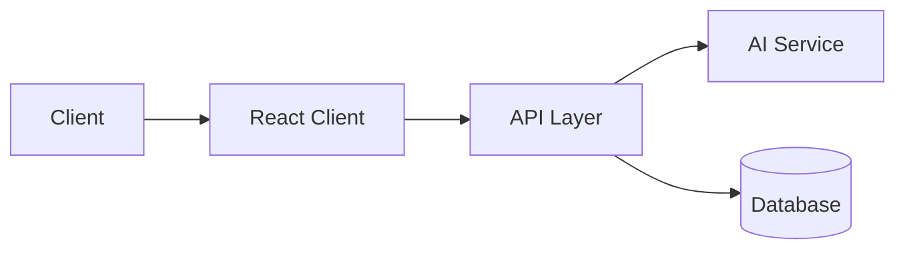
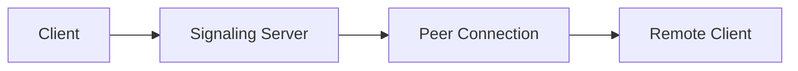

<div align="center">


<br/>

<a href="https://github.com/AmanDubey923"></a>
<a href="https://linkedin.com/in/Amankumar923"></a>
<a href="mailto:kumaraman19137@gmail.com"></a>

<br/><br/>


<br/>

<sub>Full-stack engineer focused on building and shipping complete products — from interface to backend to deployment.</sub>

<br/><br/>

<p>
  <a href="#about">About</a> •
  <a href="#stack">Stack</a> •
  <a href="#projects">Projects</a> •
  <a href="#focus">Focus</a> •
  <a href="#learning">Learning</a> •
  <a href="#activity">Activity</a> •
  <a href="#connect">Connect</a>
</p>

</div>

<br/>

<h2 id="about">01 — Snapshot</h2>

```ts
const developer = {
  name: "Aman Dubey",
  role: "Full-Stack Developer",
  focus: ["Web Applications", "AI-Integrated Products", "Real-Time Systems"],
  building: ["Dentiva AI", "AI-FITNESS", "Interview VC Platform"],
  learning: ["System Design", "Advanced DSA", "Production AI Engineering"],
  philosophy: "Ship working software, then refine it with intent.",
};
```

<br/>

<h2>02 — Now</h2>

```text
NOW
├── Building     → AI-assisted product interfaces
├── Learning     → System design & scalable backend architecture
├── Improving    → Production-grade code quality and structure
└── Exploring    → Applied AI in everyday developer tools
```

<br/>

<h2 id="stack">03 — Stack</h2>

<table>
<tr>
<td valign="top" width="33%">

**Frontend**


</td>
<td valign="top" width="33%">

**Backend**


</td>
<td valign="top" width="33%">

**Database**


</td>
</tr>
<tr>
<td valign="top" width="33%">

**AI / Automation**


</td>
<td valign="top" width="33%">

**DevOps**


</td>
<td valign="top" width="33%">

**Tools**


</td>
</tr>
</table>

<br/>

<h2 id="projects">04 — Featured Projects</h2>

### ▸ Dentiva AI

**AI-integrated platform for dental care workflows.**

Built to explore how AI can be layered into a real-world healthcare use case — combining a clean user-facing interface with an intelligent processing layer.

<details>
<summary>⚙️ Details</summary>

<br/>

- **Solves:** Bridges patients and dental care through an AI-assisted interface
- **Stack:** React, Node.js, AI integration layer
- **Status:** `Live`



</details>

<p>
<a href="https://github.com/amandubey923/dentiva-ai"></a>
<a href="https://dentiva-ai-aman.netlify.app/"></a>
</p>

---

### ▸ AI-FITNESS

**AI-assisted fitness tracking and guidance application.**

A product exploring how AI can personalize fitness guidance through an interactive, responsive interface.

<details>
<summary>⚙️ Details</summary>

<br/>

- **Solves:** Personalized fitness tracking powered by AI logic
- **Stack:** React, Node.js, AI integration
- **Status:** `Live`

</details>

<p>
<a href="https://github.com/amandubey923/ai-fitness"></a>
<a href="https://ai-fitness-aman.netlify.app/"></a>
</p>

---

### ▸ Interview VC Platform

**Real-time video calling platform built for interviews.**

A full-stack real-time communication product — focused on low-latency video, clean session handling, and a practical interview-oriented UX.

<details>
<summary>⚙️ Details</summary>

<br/>

- **Solves:** Real-time remote interviewing through live video sessions
- **Stack:** React, Node.js, WebRTC / real-time layer
- **Status:** `Live`



</details>

<p>
<a href="https://github.com/amandubey923/Interview-video-calling-platform"></a>
<a href="https://video-calling-interview-plattform.netlify.app/"></a>
</p>

<br/>

<h2 id="focus">05 — Engineering Focus</h2>

I build complete products, not isolated components — end-to-end, from UI to API to deployment. My current interest is in AI-integrated applications: interfaces that stay simple while the logic underneath does real work. I care about real-time systems, clean API design, and interfaces that communicate state clearly to the user.

<br/>

**Principles**

```text
> Build before overengineering.
> Understand systems, not just syntax.
> Prefer measurable progress over motion.
> Design for maintainability, not just for demos.
> Ship, observe, iterate.
```

<br/>

<h2 id="learning">06 — Currently Learning</h2>

<table>
<tr><td width="50%">

**System Design**
Structuring applications that scale beyond a single use case.

</td><td width="50%">

**Advanced DSA**
Strengthening problem-solving fundamentals.

</td></tr>
<tr><td width="50%">

**Production AI Engineering**
Moving from AI experiments to reliable, integrated features.

</td><td width="50%">

**Backend Architecture**
Structuring services for clarity and scale.

</td></tr>
</table>

<br/>

<h2 id="activity">07 — Activity</h2>

<div align="center">


<br/>


</div>

<br/>

<h2 id="connect">08 — Let's Build</h2>

<div align="center">

Open to conversations about full-stack engineering, AI-integrated products, and interesting problems worth solving.

<p>
<a href="https://github.com/AmanDubey923"></a>
<a href="https://linkedin.com/in/Amankumar923"></a>
<a href="mailto:kumaraman19137@gmail.com"></a>
</p>

</div>

<br/>

<div align="center">

</div>
