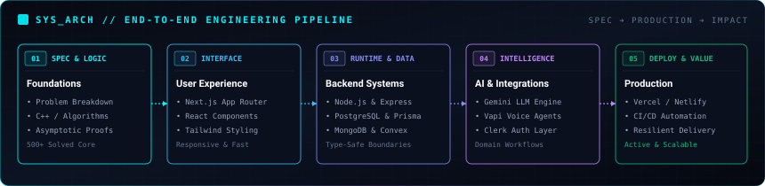
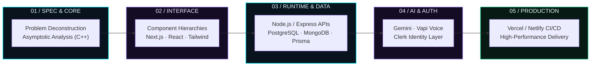
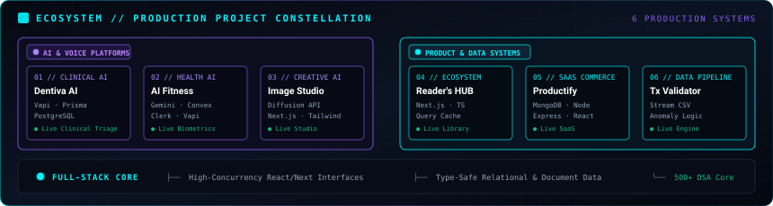
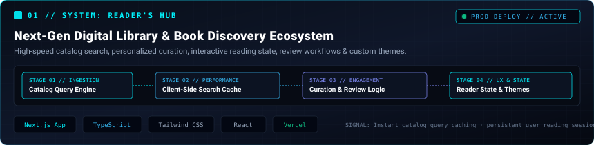
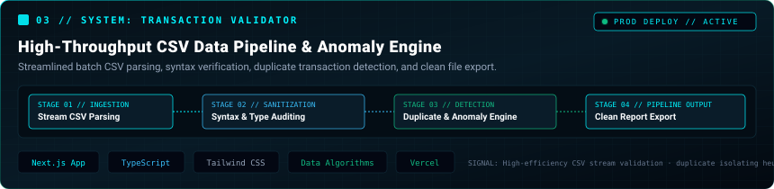
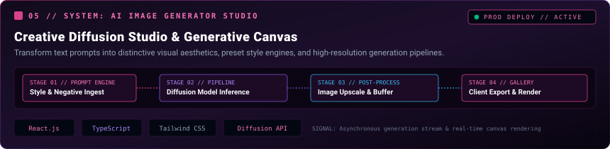
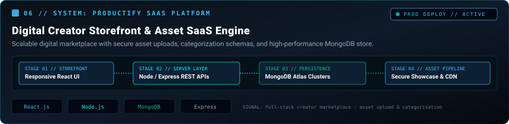
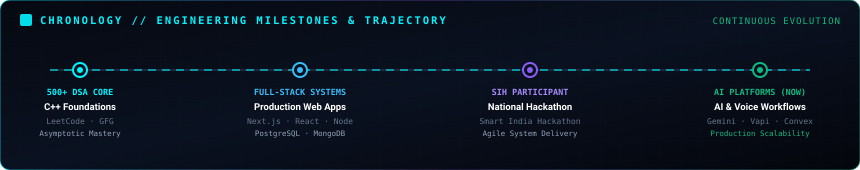
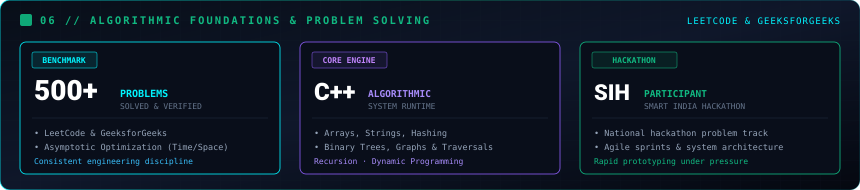

<!--
  =============================================================================
  AMAN DUBEY (KUMAR) // FULL-STACK SOFTWARE ENGINEER & SYSTEMS ARCHITECT
  ENGINEERING DOSSIER & SYSTEM ARCHITECTURE COMMAND CENTER
  Primary Source of Truth: https://aman-portfolio-next.netlify.app/
  =============================================================================
-->

<div align="center">

<p align="center">
  
</p>

# ◈ AMAN DUBEY ◈

<p align="center">
  
</p>

<sub>Architecting high-performance, scalable web systems and modern interactive user experiences with production-grade engineering practices.</sub>

<br /><br />

[【 🌐 LIVE PORTFOLIO 】](https://aman-portfolio-next.netlify.app/) &nbsp;&nbsp;·&nbsp;&nbsp; [【 ⚡ GITHUB REPOSITORIES 】](https://github.com/amandubey923) &nbsp;&nbsp;·&nbsp;&nbsp; [【 💼 LINKEDIN 】](https://www.linkedin.com/in/aman-kr-dubey) &nbsp;&nbsp;·&nbsp;&nbsp; [【 📄 RESUME DOSSIER 】](https://aman-portfolio-next.netlify.app/resume/Resume2.pdf)

<br /><br />

```text
┌── COMMAND DIRECTORY ────────────────────────────────────────────────────────────────────────────────────┐
│ [01] SYSTEM CONSOLE  │ [02] ARCHITECTURE  │ [03] ECOSYSTEM CONSTELLATION │ [04] PRODUCTION BUILDS      │
│ [05] STACK TAXONOMY  │ [06] 500+ DSA CORE │ [07] GITHUB COMMAND CENTER   │ [08] TRANSMISSION CHANNEL   │
└─────────────────────────────────────────────────────────────────────────────────────────────────────────┘
```

</div>

---

## 01 // SYSTEM CONSOLE & TELEMETRY

```text
┌───────────────────────────────────────── AMAN://ENGINEERING_OS ─────────────────────────────────────────┐
│ STATUS       ● ONLINE [v4.2]                   KERNEL       NEXT.JS / REACT / NODE.JS                   │
│ ROLE         Full-Stack Software Engineer      FOUNDATION   C++ · Algorithmic Architecture (500+ DSA)   │
│ FOCUS        Scalable Systems & AI Workflows   PERSISTENCE  PostgreSQL · MongoDB · Prisma · Convex      │
│ SIGNAL       Shipping production-grade web systems with typed boundaries and deliberate interfaces       │
│ UPTIME       CONTINUOUS EXECUTION              MILESTONE    Smart India Hackathon (SIH) Participant     │
└─────────────────────────────────────────────────────────────────────────────────────────────────────────┘
```

<details open>
<summary><strong>📡 LIVE "NOW" VECTOR // CURRENT ENGINEERING FOCUS</strong></summary>

<br />

```text
CURRENT_VECTOR
├── 🚀 BUILDING   → Production-grade web ecosystems with Next.js App Router, TypeScript & Tailwind
├── 🧠 PRACTICING → Asymptotic optimization and advanced tree/graph algorithms in C++ (500+ solved)
├── ⚡ INTEGRATING → Real-time conversational AI workflows (Gemini LLM, Vapi Voice) and secure auth
└── 🛠️ REFINING   → Resilient database schemas, query caching strategies, and end-to-end type safety
```

</details>

---

## 02 // ENGINEERING DOCTRINE & THE FOUR AXIOMS

```text
┌── THE FOUR AXIOMS ──────────────────────────────────────────────────────────────────────────────────────┐
│                                                                                                         │
│  01. DECONSTRUCT FIRST    Master the algorithmic invariants before writing a single line of interface.  │
│  02. THINK IN FLOWS       Connect visual components directly to typed state and resilient backend data. │
│  03. SHIP WITH INTENT     Prefer clean, self-documenting code over ornamental over-engineering.         │
│  04. COMPOUND DAILY       Every bug, edge case, and commit is a long-term investment in technical mastery.│
│                                                                                                         │
└─────────────────────────────────────────────────────────────────────────────────────────────────────────┘
```

---

## 03 // END-TO-END ENGINEERING PIPELINE

> *"I don't just assemble frameworks. I engineer end-to-end systems that transform complex specifications into reliable, performant user value."*

<p align="center">
  
</p>



---

## 04 // PRODUCTION PROJECT CONSTELLATION

The portfolio architecture spans two interdependent engineering clusters: **AI & Voice Intelligence Platforms** and **High-Throughput Product & Data Systems**.

<p align="center">
  
</p>

---

## 05 // FEATURED PRODUCTION SYSTEMS

<br />

### ◈ 01 / READER'S HUB — Digital Library & Reading Ecosystem

<p align="center">
  
</p>

```text
SYSTEM ID      PROJECT_01 // READER'S HUB
PARADIGM       Next-Gen Digital Library & Book Discovery Platform
STACK          Next.js (App Router) · TypeScript · Tailwind CSS · React · Responsive UI · Vercel
LIVE STATUS    ● PRODUCTION ONLINE
```

- **Architectural Overview:** Architected a modern digital reading platform featuring instant multi-attribute catalog search, personalized book curation, community review flows, and customizable reading display themes.
- **Engineering Highlights:**
  - Designed an optimized client-side query and caching layer for fluid book discovery across expansive catalogs.
  - Engineered persistent reader state management allowing seamless bookmarking, review curation, and reading preference retention.
  - Implemented responsive, zero-layout-shift UI components optimized for desktop, tablet, and mobile reading.

<div align="center">

[【 🚀 LAUNCH LIVE SYSTEM 】](https://reader-hub-library.vercel.app/) &nbsp;&nbsp;&nbsp;&nbsp; [【 📦 INSPECT SOURCE CODE 】](https://github.com/amandubey923/library-optimized)

</div>

---

### ◈ 02 / DENTIVA AI — Clinical Dental Assistant & Voice Triage

<p align="center">
  
</p>

```text
SYSTEM ID      PROJECT_02 // DENTIVA AI
PARADIGM       AI-Powered Clinical Dental Assistant & Conversational Triage
STACK          Next.js · TypeScript · Prisma ORM · PostgreSQL · Clerk Auth · Vapi Voice AI · Netlify
LIVE STATUS    ● PRODUCTION ONLINE
```

- **Architectural Overview:** Built an intelligent clinical assistant enabling interactive voice-driven dental symptom triage, doctor schedule management, and real-time appointment reservation.
- **Engineering Highlights:**
  - Architected a robust, type-safe relational database schema utilizing Prisma ORM with PostgreSQL for doctor availability and patient bookings.
  - Integrated real-time conversational voice agents using Vapi AI to conduct preliminary diagnostic Q&A and route urgency tiers.
  - Enforced enterprise-grade authentication and route-level authorization barriers with Clerk.

<div align="center">

[【 🚀 LAUNCH LIVE SYSTEM 】](https://dentiva-ai-aman.netlify.app) &nbsp;&nbsp;&nbsp;&nbsp; [【 📦 INSPECT SOURCE CODE 】](https://github.com/amandubey923/dentiva-ai)

</div>

---

### ◈ 03 / TRANSACTION VALIDATOR — High-Throughput CSV Anomaly Engine

<p align="center">
  
</p>

```text
SYSTEM ID      PROJECT_03 // TRANSACTION VALIDATOR
PARADIGM       High-Throughput Financial CSV Data Pipeline & Anomaly Engine
STACK          Next.js · TypeScript · Tailwind CSS · Data Parsing Algorithms · Vercel
LIVE STATUS    ● PRODUCTION ONLINE
```

- **Architectural Overview:** Developed a high-performance CSV batch processor engineered to ingest, audit, sanitize, and validate transaction records with automated duplicate and anomaly flagging.
- **Engineering Highlights:**
  - Constructed efficient client-side stream parsing algorithms to ingest large CSV transaction datasets with minimal UI blocking.
  - Implemented mathematical validation heuristics to identify malformed syntax, outlier amounts, and duplicate record signatures.
  - Built an automated reporting interface that exports sanitized records and structured audit summaries.

<div align="center">

[【 🚀 LAUNCH LIVE SYSTEM 】](https://transaction-validator-aman.vercel.app) &nbsp;&nbsp;&nbsp;&nbsp; [【 📦 INSPECT SOURCE CODE 】](https://github.com/amandubey923/transaction-validator)

</div>

---

### ◈ 04 / AI FITNESS PLATFORM — Biometric Workout & Nutrition Assistant

<p align="center">
  
</p>

```text
SYSTEM ID      PROJECT_04 // AI FITNESS PLATFORM
PARADIGM       Intelligent Workout & Nutrition Assistant
STACK          Next.js · TypeScript · Convex DB · Clerk Auth · Google Gemini AI · Vapi AI · Netlify
LIVE STATUS    ● PRODUCTION ONLINE
```

- **Architectural Overview:** Architected an adaptive fitness web application that analyzes user biometrics and fitness targets to formulate personalized dietary and workout routines with conversational voice assistance.
- **Engineering Highlights:**
  - Engineered reactive, real-time client state synchronization using Convex backend functions.
  - Structured prompt pipelines with Google Gemini for structured nutritional recommendation outputs.
  - Incorporated bidirectional conversational voice interaction via Vapi AI for interactive coaching sessions.

<div align="center">

[【 🚀 LAUNCH LIVE SYSTEM 】](https://ai-fitness-aman.netlify.app) &nbsp;&nbsp;&nbsp;&nbsp; [【 📦 INSPECT SOURCE CODE 】](https://github.com/amandubey923/ai-fitness)

</div>

---

### ◈ 05 / AI IMAGE GENERATOR STUDIO — Creative Diffusion Studio

<p align="center">
  
</p>

```text
SYSTEM ID      PROJECT_05 // AI IMAGE GENERATOR STUDIO
PARADIGM       Full-Stack Creative Diffusion Studio & Generative Canvas
STACK          React.js · TypeScript · Tailwind CSS · Generative Diffusion API · Netlify
LIVE STATUS    ● PRODUCTION ONLINE
```

- **Architectural Overview:** Built a full-stack creative diffusion application enabling creators to transform text prompts into distinctive visual aesthetics with customizable generation parameters.
- **Engineering Highlights:**
  - Implemented an asynchronous client-side generation stream with responsive loading states and error recovery.
  - Built preset style injectors that optimize user prompt tokens for stylized artistic outputs.
  - Engineered client-side image upscaling preview buffers and instant one-click export workflows.

<div align="center">

[【 🚀 LAUNCH LIVE SYSTEM 】](https://image-generator-studio.netlify.app) &nbsp;&nbsp;&nbsp;&nbsp; [【 📦 INSPECT SOURCE CODE 】](https://github.com/amandubey923/image-generator)

</div>

---

### ◈ 06 / PRODUCTIFY SAAS PLATFORM — Digital Creator Storefront

<p align="center">
  
</p>

```text
SYSTEM ID      PROJECT_06 // PRODUCTIFY SAAS PLATFORM
PARADIGM       Digital Creator Storefront & Asset Showcase Engine
STACK          React.js / Next.js · Node.js · Express.js · MongoDB Atlas · Tailwind CSS · Vercel
LIVE STATUS    ● PRODUCTION ONLINE
```

- **Architectural Overview:** Developed a full-stack SaaS platform empowering digital creators to securely upload, categorize, showcase, and manage digital product listings.
- **Engineering Highlights:**
  - Constructed RESTful backend endpoints with Node.js and Express for product lifecycle management.
  - Modeled document schemas in MongoDB Atlas with indexing on product categories and tags for rapid retrieval.
  - Built an intuitive creator dashboard for asset management and listing analytics.

<div align="center">

[【 🚀 LAUNCH LIVE SYSTEM 】](https://frontend-productify.vercel.app) &nbsp;&nbsp;&nbsp;&nbsp; [【 📦 INSPECT SOURCE CODE 】](https://github.com/amandubey923/productify)

</div>

---

<details>
<summary><strong>📂 EXPLORE ADDITIONAL PUBLIC MODULES & REPOSITORIES</strong></summary>

<br />

| Module | Architectural Overview | Source |
| :--- | :--- | :--- |
| **Interview VC Platform** | Real-time video conferencing, Monaco code editor, and Convex state sync. | [GitHub ↗](https://github.com/amandubey923/Interview-video-calling-platform) &nbsp;·&nbsp; [Live ↗](https://video-calling-interview-plattform.netlify.app/) |
| **TextWorkspace** | React-powered text editing and document formatting workspace with fluid animations. | [GitHub ↗](https://github.com/amandubey923/TextWorkspace) |
| **Reserve Food** | MERN-stack restaurant table reservation platform with admin dashboard workflows. | [GitHub ↗](https://github.com/amandubey923/Reserve-Food) |
| **DSA Practice Core** | Core repository containing 500+ data structure & algorithm implementations in C++. | [GitHub ↗](https://github.com/amandubey923/DSA) |

</details>

---

## 06 // TECHNOLOGY ARCHITECTURE BY LAYER

```text
┌── ENGINEERING STACK MATRIX ─────────────────────────────────────────────────────────────────────────────┐
│ 01 // LANGUAGES           C++ · TypeScript · JavaScript · Python                                        │
│ 02 // INTERFACE           Next.js (App Router) · React · Tailwind CSS · Modern Web APIs                │
│ 03 // RUNTIME & API       Node.js · Express.js · RESTful API Architecture                              │
│ 04 // PERSISTENCE         PostgreSQL · MongoDB · Prisma ORM · Convex · Neon SQL · Firebase             │
│ 05 // AI & SERVICES       Gemini AI · Vapi Voice Assistant · Clerk Authentication                      │
│ 06 // CLOUD & DELIVERY    Git · GitHub Actions · Vercel · Netlify · Render · VS Code                    │
│ 07 // COMPUTER SCIENCE    Data Structures & Algorithms · System Design · OOP · Operating Systems       │
└─────────────────────────────────────────────────────────────────────────────────────────────────────────┘
```

<details>
<summary><strong>🔍 VIEW DETAILED TOOLING TAXONOMY</strong></summary>

<br />

| Layer | Technologies & Ecosystem |
| :--- | :--- |
| **Core Languages** | `C++` (Algorithmic Core) · `TypeScript` (Strict Typing) · `JavaScript` (ESNext) · `Python` |
| **Frontend Frameworks** | `Next.js 14+` · `React.js` · `Tailwind CSS` · `Component-Driven UI` · `Responsive Layouts` |
| **Backend & APIs** | `Node.js` · `Express.js` · `REST Endpoints` · `Server Actions` · `Route Handlers` |
| **Databases & Storage** | `PostgreSQL` · `MongoDB` · `Prisma ORM` · `Convex DB` · `Neon Serverless Postgres` · `Firebase` |
| **AI & Integrations** | `Google Gemini API` · `Vapi AI Voice SDK` · `Clerk Identity & RBAC` |
| **DevOps & Platforms** | `Git` · `GitHub` · `Vercel` · `Netlify` · `Render` · `VS Code` · `Postman` |
| **CS Fundamentals** | `Complexity Analysis (Big O)` · `Data Structures` · `OOP Principles` · `OS & Networking` |

</details>

---

## 07 // ENGINEERING JOURNEY & CHRONOLOGY

<p align="center">
  
</p>

```text
2023 ─────────────────────────────────────────────────────────────────────────────────────────────► NOW
FULL-STACK & SYSTEMS ENGINEERING
├── 01 // COMPUTATIONAL FOUNDATIONS   → 500+ DSA problems solved in C++ across LeetCode and GFG
├── 02 // PRODUCTION WEB SYSTEMS      → Scalable Next.js, React, Node.js, and multi-model database builds
├── 03 // SMART INDIA HACKATHON (SIH) → National hackathon participation, agile architecture & live sprints
└── 04 // AI PLATFORMS & VOICE AGENTS → Practical generative integrations with Gemini & Vapi AI (Current Focus)
```

---

## 08 // ALGORITHMIC FOUNDATIONS & MILESTONES

<p align="center">
  
</p>

### ◈ 500+ Algorithmic Problems Solved
- **Primary Core:** `C++` — master of standard template library (STL), memory models, pointer arithmetic, and algorithmic trade-offs.
- **Problem Domains:** Arrays & Hashing, Two Pointers, Sliding Window, Linked Lists, Trees & Binary Search Trees, Graphs (BFS/DFS, Dijkstra), Dynamic Programming, and Recursion.
- **Platforms:** Active competitive solver on [LeetCode (aman_dubey923)](https://leetcode.com/u/aman_dubey923) and [GeeksforGeeks (kumaramag0dt)](https://www.geeksforgeeks.org/profile/kumaramag0dt).

### ◈ Smart India Hackathon (SIH) Participant
- **Collaborative Engineering:** Active participant across national-level SIH problem selection and technical prototyping rounds.
- **Rapid Architecture:** Collaborated in high-velocity agile sprints, formulating database schemas, system architecture, and real-time frontend interfaces under competitive deadlines.

---

## 09 // GITHUB COMMAND CENTER & ACTIVITY

<div align="center">

<p align="center">
  
  
</p>

[](https://github.com/amandubey923)

</div>

---

## 10 // SECURE TRANSMISSION CHANNEL

```text
══════════════════════════════════════ TRANSMISSION OPEN ══════════════════════════════════════
Whether you're exploring full-stack engineering talent, building next-generation web products,
or discussing system architecture — initiate communication below.
════════════════════════════════════════════════════════════════════════════════════════════════
```

<div align="center">

| Channel | Destination | Signal |
| :--- | :--- | :--- |
| **🌐 Portfolio Dossier** | [aman-portfolio-next.netlify.app](https://aman-portfolio-next.netlify.app/) | `PROD_ACTIVE` |
| **💼 LinkedIn Network** | [linkedin.com/in/aman-kr-dubey](https://www.linkedin.com/in/aman-kr-dubey) | `DIRECT_CONNECT` |
| **⚡ GitHub Profile** | [github.com/amandubey923](https://github.com/amandubey923) | `SOURCE_ROOT` |
| **🧠 LeetCode Profile** | [leetcode.com/u/aman_dubey923](https://leetcode.com/u/aman_dubey923) | `500+_SOLVED` |
| **🎯 GeeksforGeeks** | [geeksforgeeks.org/profile/kumaramag0dt](https://www.geeksforgeeks.org/profile/kumaramag0dt) | `GFG_BADGE` |
| **📧 Direct Email** | [kumaraman19137@gmail.com](mailto:kumaraman19137@gmail.com) | `ENCRYPTED_INBOX` |
| **📄 Official Resume** | [Download Resume PDF](https://aman-portfolio-next.netlify.app/resume/Resume2.pdf) | `VERIFIED_DOC` |

<br />

```text
[ END OF TRANSMISSION // AMAN DUBEY · FULL-STACK SOFTWARE ENGINEER ]
```

</div>