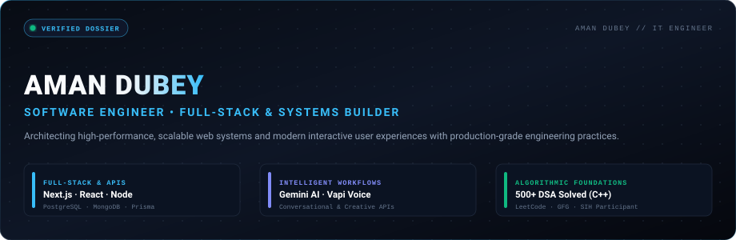
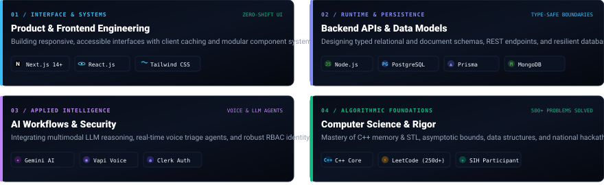
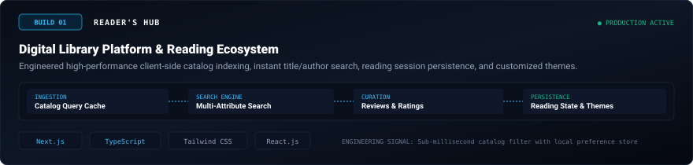
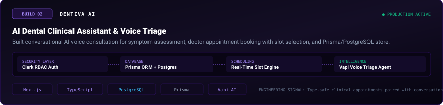
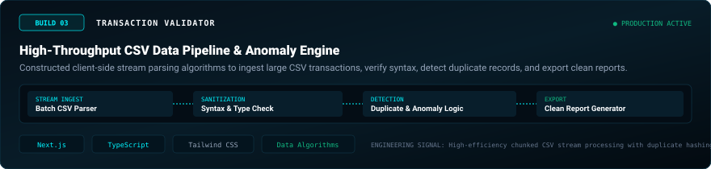
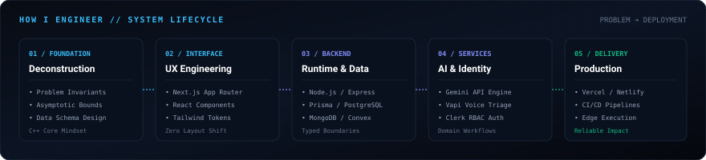
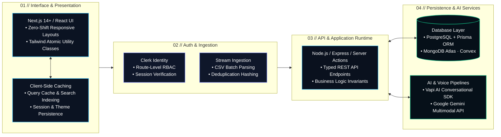
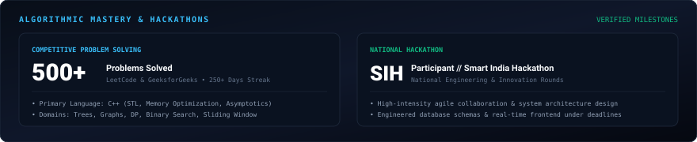

<div align="center">

<p align="center">
  
</p>

# Aman Dubey

**Software Engineer • Full-Stack Developer • Systems Builder**  
*B.Tech in Information Technology • 500+ Algorithmic Problems Solved (C++) • Smart India Hackathon (SIH) Participant*

<br />

[](https://aman-portfolio-next.netlify.app/)
[](https://aman-portfolio-next.netlify.app/resume/Resume2.pdf)
[](https://www.linkedin.com/in/aman-kr-dubey)
[](https://github.com/amandubey923)
[](https://leetcode.com/u/aman_dubey923)
[](mailto:kumaraman19137@gmail.com)

<br />

<!-- QUICK HUD NAVIGATION -->
<table>
  <tr>
    <td align="center"><a href="#01--engineering-identity-matrix"><b>01 // IDENTITY</b></a></td>
    <td align="center"><a href="#02--featured-production-systems"><b>02 // FLAGSHIP BUILDS</b></a></td>
    <td align="center"><a href="#03--extended-project-ecosystem"><b>03 // ECOSYSTEM</b></a></td>
    <td align="center"><a href="#04--how-i-engineer--system-lifecycle"><b>04 // ARCHITECTURE</b></a></td>
    <td align="center"><a href="#05--technical-stack-taxonomy"><b>05 // TECH STACK</b></a></td>
    <td align="center"><a href="#06--algorithmic-foundations--hackathons"><b>06 // DSA &amp; HACKATHONS</b></a></td>
    <td align="center"><a href="#07--github-activity--metrics"><b>07 // METRICS</b></a></td>
    <td align="center"><a href="#08--direct-connect--transmission"><b>08 // CONNECT</b></a></td>
  </tr>
</table>

</div>

<br />

---

## 01 // Engineering Identity Matrix

> Information Technology engineer architecting full-stack products where reactive interfaces, resilient backends, distributed data, and intelligent AI services converge on verified algorithmic foundations.

<p align="center">
  
</p>

<table>
  <tr>
    <td width="50%" valign="top">
      <h4>⚡ 01 / Interface &amp; Product Systems</h4>
      <ul>
        <li><b>Zero-Shift UI:</b> Engineered with Next.js 14+ (App Router), React, and Tailwind CSS for instant hydration and responsive fluid layouts.</li>
        <li><b>Client-Side Caching:</b> Query memoization and persistent state machines to eliminate layout thrashing and redundant network calls.</li>
        <li><b>Accessibility &amp; UX:</b> Strict semantic HTML, responsive viewport scaling, and keyboard-navigable interaction flows.</li>
      </ul>
    </td>
    <td width="50%" valign="top">
      <h4>🛡️ 02 / Backend &amp; Distributed Data</h4>
      <ul>
        <li><b>Robust Server APIs:</b> Node.js &amp; Express.js RESTful endpoints paired with Next.js Server Actions for secure edge execution.</li>
        <li><b>Relational &amp; Document Stores:</b> Typed data models with PostgreSQL &amp; Prisma ORM alongside scalable MongoDB Atlas clusters.</li>
        <li><b>Session &amp; Security:</b> Route-level role-based authorization (RBAC), token validation, and Clerk Identity protection.</li>
      </ul>
    </td>
  </tr>
  <tr>
    <td width="50%" valign="top">
      <h4>🤖 03 / Intelligent AI Workflows</h4>
      <ul>
        <li><b>Voice-Driven Agents:</b> Bidirectional conversational voice pipelines via Vapi AI SDK for clinical and triage applications.</li>
        <li><b>LLM Integrations:</b> Structured prompt engineering and multimodal reasoning utilizing the Google Gemini API.</li>
        <li><b>Real-Time Sync:</b> Event-driven architectures and reactive document updates powered by Convex DB.</li>
      </ul>
    </td>
    <td width="50%" valign="top">
      <h4>🧠 04 / Algorithmic Core</h4>
      <ul>
        <li><b>Asymptotic Rigor:</b> Strict $O(N)$ and $O(\log N)$ algorithmic space/time bounds informed by 500+ competitive C++ problem solutions.</li>
        <li><b>Data Structures:</b> Mastery over Trees, Graphs (BFS/DFS), Dynamic Programming, Sliding Windows, and Heap structures.</li>
        <li><b>System Invariants:</b> Translating complex business logic into verifiable, clean, and bug-resistant state transitions.</li>
      </ul>
    </td>
  </tr>
</table>

<br />

---

## 02 // Featured Production Systems

Flagship production builds demonstrating end-to-end full-stack engineering, conversational AI triage, and high-throughput data parsing algorithms:

<br />

### 01 / Reader's HUB — Digital Library & Reading Ecosystem Platform

<p align="center">
  
</p>

* **Problem & Overview:** Traditional web readers suffer from sluggish catalog navigation, sluggish searches, and disjointed reading states. Reader's HUB delivers a streamlined, modern digital library with instant catalog filtering, reading sessions, curated book reviews, and user theme customization.
* **Key Architectural Highlights:**
  - **Client-Side Indexing Engine:** Engineered query caching and indexed search algorithms across title, author, and genre attributes with near-instant response times.
  - **Persistent Session State:** Implemented resilient browser state management to persist reader progress, active bookmarks, and dark/light themes without hydration mismatch.
  - **Component Hierarchy:** Crafted responsive book detail modals, rating aggregates, and reader-first UI components styled with Tailwind CSS.
* **Core Stack:** `Next.js (App Router)` · `TypeScript` · `Tailwind CSS` · `React.js` · `Node.js` · `Vercel`

<div align="center">

[](https://reader-hub-library.vercel.app/)
&nbsp;&nbsp;&nbsp;&nbsp;
[](https://github.com/amandubey923/library-optimized)

</div>

<details>
  <summary><b>🔍 Click to view Deep-Dive Technical Implementation: Reader's HUB</b></summary>
  <br />

  | Engineering Layer | Implementation Specifics |
  | :--- | :--- |
  | **Routing & Rendering** | Next.js App Router with hybrid Static Site Generation (SSG) for static book catalogs and Client Components for dynamic search interactions. |
  | **Search Strategy** | Multi-attribute client-side fuzzy filter reducing server round-trips for catalog browsing. |
  | **State Persistence** | Synchronized `localStorage` state hooks with zero layout flickers on cold reloads. |
  | **Deployment** | Continuous deployment via Vercel Edge Network with asset optimization and zero build downtime. |
</details>

<br />

---

### 02 / Dentiva AI — Clinical Dental Assistant & Voice Triage

<p align="center">
  
</p>

* **Problem & Overview:** Dental clinics experience recurring front-desk bottlenecks in preliminary symptom screening, patient intake, and schedule coordination. Dentiva AI bridges this gap with an autonomous clinical assistant capable of real-time conversational voice intake and real-time appointment booking.
* **Key Architectural Highlights:**
  - **Bidirectional Conversational Voice Agent:** Integrated Vapi AI voice pipelines allowing patients to describe dental symptoms naturally and receive instant triage guidance.
  - **Type-Safe Scheduling Store:** Architected a relational schema with Prisma ORM and PostgreSQL to manage doctor availability, time slots, and patient appointment records.
  - **Security & Authorization:** Enforced route-level authentication and protected scheduling dashboards using Clerk Identity.
* **Core Stack:** `Next.js` · `TypeScript` · `Prisma ORM` · `PostgreSQL` · `Clerk Auth` · `Vapi Voice AI` · `Netlify`

<div align="center">

[](https://dentiva-ai-aman.netlify.app)
&nbsp;&nbsp;&nbsp;&nbsp;
[](https://github.com/amandubey923/dentiva-ai)

</div>

<details>
  <summary><b>🔍 Click to view Deep-Dive Technical Implementation: Dentiva AI</b></summary>
  <br />

  | Engineering Layer | Implementation Specifics |
  | :--- | :--- |
  | **Voice Pipeline** | Low-latency audio streaming with Vapi Web SDK, webhook event listeners, and dynamic prompt orchestration. |
  | **Database Architecture** | Relational integrity with foreign key constraints across Patients, Appointments, and Providers in PostgreSQL via Prisma. |
  | **Identity & Sessions** | Granular role-based middleware guarding administrative appointment rosters and patient records via Clerk. |
  | **Edge Infrastructure** | Automated deployment on Netlify with secure environment variable isolation for AI and database credentials. |
</details>

<br />

---

### 03 / Transaction Validator — High-Throughput CSV Anomaly Engine

<p align="center">
  
</p>

* **Problem & Overview:** Financial operations and auditing workflows frequently struggle with corrupted CSV imports, formatting anomalies, and duplicate entries. Transaction Validator is an analytical processing pipeline designed to ingest, validate, and clean massive transaction records.
* **Key Architectural Highlights:**
  - **Chunked Client-Side Stream Parsing:** Developed batch-processing algorithms to read and parse dense CSV datasets without freezing the main browser thread.
  - **Mathematical Anomaly Heuristics:** Designed record hashing algorithms and validation checks to pinpoint duplicate IDs, malformed currencies, and schema violations.
  - **Sanitized Export Engine:** Formatted automatic error logs and downloadable cleaned CSV files for instant downstream operational consumption.
* **Core Stack:** `Next.js` · `TypeScript` · `Tailwind CSS` · `Data Parsing Algorithms` · `Vercel`

<div align="center">

[](https://transaction-validator-aman.vercel.app)
&nbsp;&nbsp;&nbsp;&nbsp;
[](https://github.com/amandubey923/transaction-validator)

</div>

<details>
  <summary><b>🔍 Click to view Deep-Dive Technical Implementation: Transaction Validator</b></summary>
  <br />

  | Engineering Layer | Implementation Specifics |
  | :--- | :--- |
  | **Stream Processing** | Iterative chunk parsing avoiding out-of-memory browser crashes on multi-megabyte CSV files. |
  | **Validation Matrix** | Hash set deduplication $O(1)$ lookup time, ISO currency code checks, and timestamp consistency verification. |
  | **Interactive Reporting**| Real-time visual metrics dashboard displaying error distribution, passed records, and row anomaly indicators. |
  | **Data Sanitization** | Client-side blob generation allowing users to download sanitized records with zero server retention for privacy. |
</details>

<br />

---

## 03 // Extended Project Ecosystem

Additional verified full-stack applications, real-time collaboration engines, and algorithmic repositories across my GitHub profile:

| Project Name | Architecture & Stack | Key Engineering Highlights | Links |
| :--- | :--- | :--- | :--- |
| **AI Fitness** | `Next.js` · `TypeScript` · `Convex` · `Clerk` · `Google GenAI` · `Vapi` | Full-stack AI fitness web application pairing workout logging with multimodal Gemini prompt reasoning and voice feedback. | [🌐 Live Demo](https://ai-fitness-aman.netlify.app/) &nbsp;\|&nbsp; [📦 Code](https://github.com/amandubey923/ai-fitness) |
| **Interview VC Platform** | `Next.js` · `Stream Video SDK` · `Convex` · `Clerk` · `Monaco Editor` | Real-time collaborative technical interview workspace with synchronized video calling, code editor, and live chat. | [🌐 Live Demo](https://video-calling-interview-plattform.netlify.app/) &nbsp;\|&nbsp; [📦 Code](https://github.com/amandubey923/Interview-video-calling-platform) |
| **TextWorkspace** | `React.js` · `JavaScript` · `Tailwind CSS` · `Framer Motion` | Modern web utility for text transformations, word metrics, case conversion, and dynamic text document exports. | [📦 Code](https://github.com/amandubey923/TextWorkspace) |
| **Reserve Food** | `Node.js` · `Express.js` · `MongoDB` · `React.js` · `MERN` | Restaurant reservation system featuring table booking schedules, menu catalog browsing, and administrative portal. | [📦 Code](https://github.com/amandubey923/Reserve-Food) |
| **C++ DSA Repository** | `C++` · `STL` · `Algorithms` · `Data Structures` | Central competitive programming repository documenting optimized solutions across trees, graphs, DP, and search. | [📦 Code](https://github.com/amandubey923/DSA) |

<br />

---

## 04 // How I Engineer // System Lifecycle

> *"Software is an end-to-end system translating complex business requirements into maintainable, performant, and resilient user value."*

<p align="center">
  
</p>



### Engineering Principles Applied

1. **Problem Formulation & Asymptotics:** Analyze mathematical bounds, data structures, and edge cases prior to writing application code.
2. **Type-Safe Contract Boundaries:** Enforce end-to-end TypeScript interfaces spanning database schemas, API contracts, and frontend state.
3. **Resilient Data Layers:** Design normalized relational structures in PostgreSQL (via Prisma) or document stores in MongoDB with appropriate indexing.
4. **Isolated AI Integrations:** Decouple conversational voice agents (Vapi) and generative models (Gemini API) behind validated backend endpoints.
5. **Continuous Deployment:** Leverage Vercel and Netlify for atomic, git-triggered releases, edge functions, and asset minification.

<br />

---

## 05 // Technical Stack Taxonomy

A categorized index of languages, frameworks, databases, and tooling actively utilized across my projects:

<table>
  <thead>
    <tr align="left">
      <th width="30%">Engineering Domain</th>
      <th width="70%">Technologies &amp; Production Tooling</th>
    </tr>
  </thead>
  <tbody>
    <tr>
      <td>
        &nbsp;
        <strong>Core Languages</strong>
      </td>
      <td>
         <code>C++ (Competitive &amp; STL)</code> &nbsp;&nbsp;
         <code>TypeScript</code> &nbsp;&nbsp;
         <code>JavaScript (ES6+)</code> &nbsp;&nbsp;
         <code>Python</code>
      </td>
    </tr>
    <tr>
      <td>
        &nbsp;
        <strong>Frontend &amp; UI Systems</strong>
      </td>
      <td>
         <code>Next.js 14+ (App Router)</code> &nbsp;&nbsp;
         <code>React.js</code> &nbsp;&nbsp;
         <code>Tailwind CSS</code> &nbsp;&nbsp;
        <code>HTML5 / CSS3</code>
      </td>
    </tr>
    <tr>
      <td>
        &nbsp;
        <strong>Backend &amp; Server APIs</strong>
      </td>
      <td>
         <code>Node.js</code> &nbsp;&nbsp;
         <code>Express.js</code> &nbsp;&nbsp;
        <code>RESTful APIs</code> &nbsp;&nbsp;
        <code>Next.js Server Actions</code>
      </td>
    </tr>
    <tr>
      <td>
        &nbsp;
        <strong>Databases &amp; Storage</strong>
      </td>
      <td>
         <code>PostgreSQL</code> &nbsp;&nbsp;
         <code>MongoDB Atlas</code> &nbsp;&nbsp;
         <code>Prisma ORM</code> &nbsp;&nbsp;
         <code>Convex Real-Time DB</code> &nbsp;&nbsp;
         <code>Neon Serverless SQL</code> &nbsp;&nbsp;
         <code>Firebase</code>
      </td>
    </tr>
    <tr>
      <td>
        &nbsp;
        <strong>AI &amp; Product Services</strong>
      </td>
      <td>
         <code>Google Gemini API</code> &nbsp;&nbsp;
         <code>Vapi AI Voice SDK</code> &nbsp;&nbsp;
         <code>Clerk Identity &amp; Auth</code>
      </td>
    </tr>
    <tr>
      <td>
        &nbsp;
        <strong>DevOps &amp; Cloud Deployment</strong>
      </td>
      <td>
         <code>Git</code> &nbsp;&nbsp;
         <code>GitHub</code> &nbsp;&nbsp;
         <code>Vercel</code> &nbsp;&nbsp;
         <code>Netlify</code> &nbsp;&nbsp;
         <code>Render</code> &nbsp;&nbsp;
         <code>Railway</code> &nbsp;&nbsp;
         <code>VS Code</code> &nbsp;&nbsp;
         <code>Postman</code>
      </td>
    </tr>
    <tr>
      <td>
        &nbsp;
        <strong>Core Computer Science</strong>
      </td>
      <td>
         <code>DSA (500+ Solved in C++)</code> &nbsp;&nbsp;
         <code>Big-O Complexity Analysis</code> &nbsp;&nbsp;
         <code>OOP Principles</code> &nbsp;&nbsp;
         <code>Operating Systems</code> &nbsp;&nbsp;
         <code>DBMS Concepts</code>
      </td>
    </tr>
  </tbody>
</table>

<br />

---

## 06 // Algorithmic Foundations & Hackathons

<p align="center">
  
</p>

### ◈ 500+ Competitive Algorithmic Solutions
* **Core Language:** `C++` — utilizing standard template library (STL) vectors, maps, heaps, and pointers with attention to memory allocation and asymptotic space/time complexity.
* **Mastered Domains:** Arrays, Strings, Two Pointers, Sliding Window, Linked Lists, Binary Trees, Binary Search Trees, Graphs (BFS/DFS, Topological Sort), Dynamic Programming, and Recursion.
* **Competitive Profiles & Consistency:**
  - Active competitive programmer with a **250+ days consistency streak** on [LeetCode (aman_dubey923)](https://leetcode.com/u/aman_dubey923).
  - Practice, problem evaluations, and badge milestones documented on [GeeksforGeeks (kumaramag0dt)](https://www.geeksforgeeks.org/profile/kumaramag0dt).

### ◈ Smart India Hackathon (SIH) Participant
* **National-Level Engineering:** Selected participant in national hackathon competition rounds, working in high-pressure collaborative sprints on real-world problem statements.
* **Execution Under Deadlines:** Architected responsive web frontends, drafted clean relational data schemas, and connected backend endpoints under strict evaluation criteria.

### ◈ Academic Foundations
* **Degree:** Bachelor of Technology in Information Technology (2023 – 2027)
* **Institution:** Chandigarh Group of Colleges (CGC Mohali / Landran)
* **Academic Merit:** Cumulative Grade Point Average (CGPA): **8.17 / 10.0**
* **Core Theoretical Coursework:** Data Structures & Algorithms, Database Management Systems (DBMS), Object-Oriented Programming (OOP), Operating Systems (OS), Computer Networks.

<br />

---

## 07 // GitHub Activity & Metrics

<div align="center">

<p align="center">
  
  
</p>

[](https://github.com/amandubey923)

<br /><br />

<details>
  <summary><b>🖥️ Click to Open: System Manifest &amp; Engineering Specs</b></summary>
  <br />

```text
================================================================================
ENGINEERING DOSSIER // AMAN DUBEY (amandubey923)
================================================================================
PRIMARY DISCIPLINE : Full-Stack Software Engineering & Distributed Web Systems
ACADEMIC DEGREE    : B.Tech in Information Technology (2023 – 2027) [CGPA: 8.17]
CORE LANGUAGES     : C++ (500+ DSA), TypeScript, JavaScript, Python
PRIMARY RUNTIME    : Next.js 14+ (App Router), React, Node.js, Express
DATA & STORAGE     : PostgreSQL (Prisma), MongoDB Atlas, Convex, Neon SQL
AI WORKFLOWS       : Vapi AI Conversational Voice SDK, Google Gemini API
COLLABORATION      : Smart India Hackathon (SIH) Participant
STREAK & PRACTICE  : 250+ Days LeetCode Streak, GeeksforGeeks Profile Active
AVAILABILITY       : Open for Software Engineering Internships & Full-Stack Roles
================================================================================
STATUS: TRANSMISSION VERIFIED // READY FOR DEPLOYMENT
================================================================================
```

</details>

</div>

<br />

---

## 08 // Direct Connect & Transmission

Whether you are recruiting for a Software Engineering / Full-Stack role, discussing technical architecture, or looking to collaborate on high-impact projects:

<div align="center">

| Channel | Direct Link | Purpose / Context |
| :--- | :--- | :--- |
| **🌐 Live Portfolio** | [aman-portfolio-next.netlify.app](https://aman-portfolio-next.netlify.app/) | Interactive portfolio showcasing production projects |
| **📄 Official Resume** | [Download Resume (PDF)](https://aman-portfolio-next.netlify.app/resume/Resume2.pdf) | Verified one-page technical resume & background |
| **💼 LinkedIn** | [linkedin.com/in/aman-kr-dubey](https://www.linkedin.com/in/aman-kr-dubey) | Professional networking & communication |
| **⚡ GitHub** | [github.com/amandubey923](https://github.com/amandubey923) | Source code, repositories & contribution graph |
| **🧠 LeetCode** | [leetcode.com/u/aman_dubey923](https://leetcode.com/u/aman_dubey923) | 500+ solved algorithmic problems & badges |
| **🎯 GeeksforGeeks** | [geeksforgeeks.org/profile/kumaramag0dt](https://www.geeksforgeeks.org/profile/kumaramag0dt) | Competitive coding track record |
| **📧 Direct Email** | [kumaraman19137@gmail.com](mailto:kumaraman19137@gmail.com) | Direct inquiries & recruitment opportunities |

<br />

```text
● STATUS: AVAILABLE FOR SOFTWARE ENGINEERING INTERNSHIPS & FULL-STACK ROLES
```

<br />

<sub>© 2026 Aman Dubey • Designed for performance, structural integrity, and verified engineering excellence.</sub>

</div>