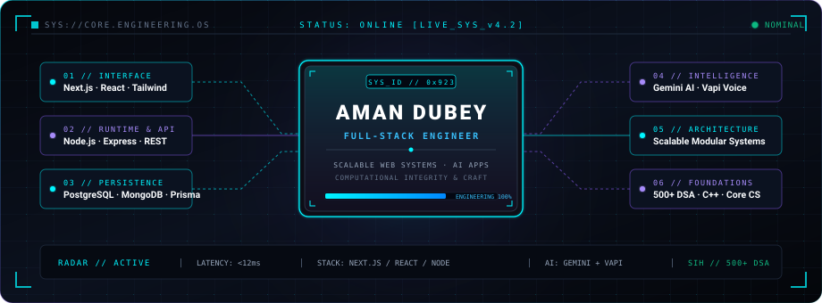
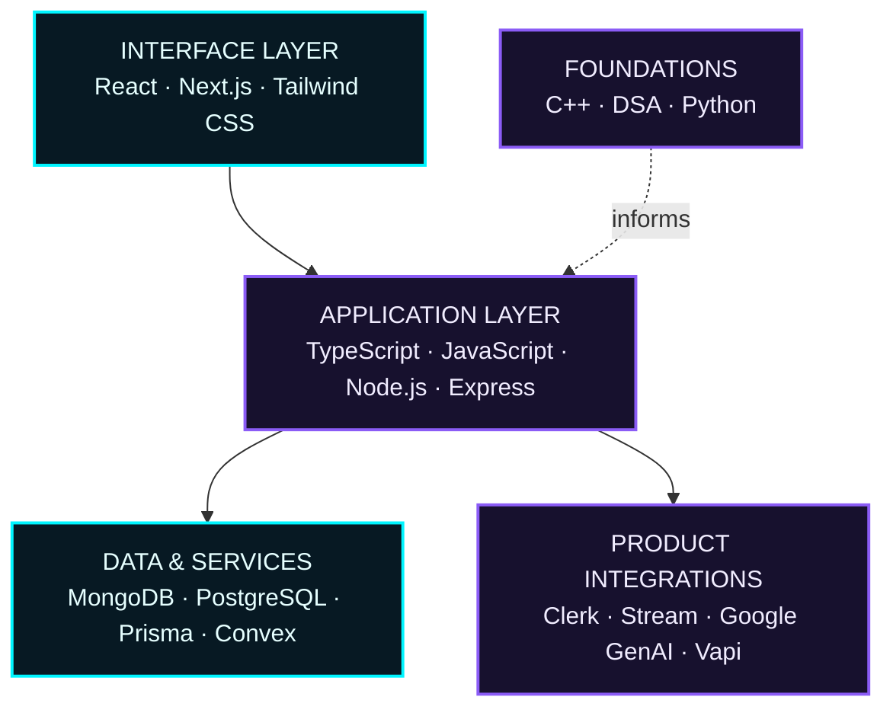
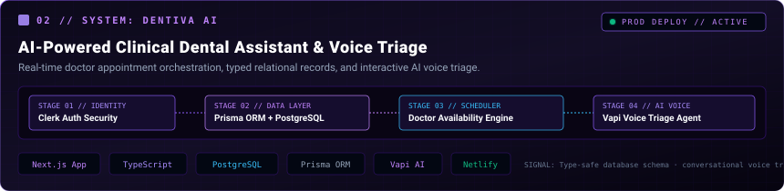
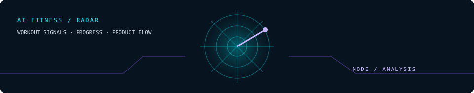
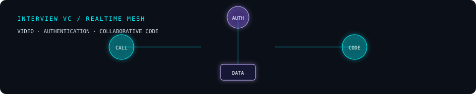

<!--
  AMAN KUMAR / GITHUB PROFILE
  Visual assets are intentionally local so this profile has a durable, custom identity.
  Update the NOW panel and featured project copy as the work evolves.
-->

<!-- HERO -->
<p align="center">
  
</p>

<div align="center">

# Aman Kumar


<sub>Building clear, useful web products where interface, data, and product behavior meet.</sub>

<br /><br />

[【 PORTFOLIO / 01 】](https://aman-portfolio-next.netlify.app) &nbsp; [【 GITHUB / 02 】](https://github.com/amandubey923) &nbsp; [【 LINKEDIN / 03 】](https://linkedin.com/in/Amankumar923) &nbsp; [【 EMAIL / 04 】](mailto:kumaraman19137@gmail.com)

<br /><br />

[ SYSTEM ](#system-console) &nbsp;·&nbsp; [ STACK ](#technology-architecture) &nbsp;·&nbsp; [ PROJECTS ](#featured-builds) &nbsp;·&nbsp; [ ACTIVITY ](#github-command-center) &nbsp;·&nbsp; [ ROADMAP ](#learning-vector) &nbsp;·&nbsp; [ CONTACT ](#contact-channel)

</div>

<p align="center"><sub>◈ ─────────────────────────────── ◈</sub></p>

<!-- SYSTEM STATUS -->
## System console

```text
┌──────────────────────────── AMAN://SYSTEM_CONSOLE ────────────────────────────┐
│ STATUS       ● ONLINE                         MODE         BUILD / ITERATE     │
│ ROLE         Full-stack developer             INTERFACE    React · Next.js     │
│ FOCUS        Product engineering              SERVICES     Node · Express      │
│ DATA         MongoDB · PostgreSQL             PRACTICE     C++ · DSA           │
│ SIGNAL       Shipping web experiences with deliberate UI and useful workflows  │
└────────────────────────────────────────────────────────────────────────────────┘
```

<!-- NOW: Update this small panel regularly. -->
```text
NOW
├── BUILDING    → product-focused experiences with Next.js and React
├── LEARNING    → data structures and algorithms in C++
├── REFINING    → clearer user flows, type-safe boundaries, and release quality
└── EXPLORING   → AI-enabled web product interfaces
```

<details>
  <summary><strong>OPEN / ENGINEERING DOCTRINE</strong></summary>
  <br />

  ```text
  BUILD SMALL.   Start with the smallest flow that can be useful.
  THINK IN FLOWS. Connect interface decisions to data and system behavior.
  SHIP WITH CARE. Prefer readable, maintainable code over ornamental complexity.
  OBSERVE.       Treat every implementation as a chance to learn and improve.
  ```
</details>

<p align="center"><sub>╾─ DATA BUS / ARCHITECTURE ─╼</sub></p>

<!-- TECH ARCHITECTURE -->
## Technology architecture



<p align="center"><sub>INTERFACE → APPLICATION → DATA / SERVICES → USER VALUE</sub></p>

<details>
  <summary><strong>OPEN / TOOLING INDEX</strong></summary>
  <br />

  <code>JavaScript</code> <code>TypeScript</code> <code>C++</code> <code>Python</code> &nbsp;·&nbsp;
  <code>React</code> <code>Next.js</code> <code>React Native</code> &nbsp;·&nbsp;
  <code>Node.js</code> <code>Express</code> <code>MongoDB</code> <code>PostgreSQL</code> <code>Prisma</code> &nbsp;·&nbsp;
  <code>Tailwind CSS</code> <code>Convex</code> <code>Git</code>
</details>

<p align="center"><sub>◈ ─────────────────────────── FEATURED BUILDS ─────────────────────────── ◈</sub></p>

<!-- PROJECTS -->
## Featured builds

### 01 / Dentiva AI

<p align="center">
  
</p>

> **AI-powered dental product prototype** — a modern full-stack foundation for a focused domain experience.

`Next.js` `TypeScript` `Prisma` `PostgreSQL` `Clerk` `Vapi`

**Engineering signal:** combines authentication, a typed database layer, component primitives, and voice-AI client integration in one product codebase.

[【 LIVE DEMO 】](https://dentiva-ai-aman.netlify.app/) &nbsp; [【 SOURCE CODE 】](https://github.com/amandubey923/dentiva-ai)

### 02 / AI Fitness

<p align="center">
  
</p>

> **AI fitness web application** — an experiment in pairing product workflows with generative and voice-AI integrations.

`Next.js` `TypeScript` `Convex` `Clerk` `Google GenAI` `Vapi`

**Engineering signal:** brings authentication, application data, and AI service clients together within a current Next.js stack.

[【 LIVE DEMO 】](https://ai-fitness-aman.netlify.app/) &nbsp; [【 SOURCE CODE 】](https://github.com/amandubey923/ai-fitness)

### 03 / Interview VC Platform

<p align="center">
  
</p>

> **Real-time interview workspace** — video calls, authentication, and collaborative code tooling converging in a single workflow.

`Next.js` `TypeScript` `Stream` `Convex` `Clerk` `Monaco Editor`

**Engineering signal:** a multi-service product surface that connects real-time video, identity, application state, and code-editor capabilities.

[【 LIVE DEMO 】](https://video-calling-interview-plattform.netlify.app/) &nbsp; [【 SOURCE CODE 】](https://github.com/amandubey923/Interview-video-calling-platform)

<details>
  <summary><strong>OPEN / FEATURED PRODUCT SYSTEM MAP</strong></summary>
  <br />

  ```mermaid
  flowchart LR
      U["User"] --> N["Next.js product UI"]
      N --> D["Dentiva AI<br/>Clerk · Prisma · PostgreSQL · Vapi"]
      N --> F["AI Fitness<br/>Clerk · Convex · Google GenAI · Vapi"]
      N --> I["Interview VC<br/>Clerk · Convex · Stream · Monaco"]
      classDef node fill:#071923,stroke:#00F5FF,color:#E6FFFF,stroke-width:2px;
      classDef service fill:#17112E,stroke:#8B5CF6,color:#F1EDFF,stroke-width:2px;
      class U,N node;
      class D,F,I service;
  ```
</details>

<details>
  <summary><strong>OPEN / OTHER PUBLIC MODULES</strong></summary>
  <br />

  - [Transaction Validator](https://github.com/amandubey923/transaction-validator) — spreadsheet import and visual reporting in Next.js. [Live system](https://transaction-validator-pi.vercel.app)
  - [TextWorkspace](https://github.com/amandubey923/TextWorkspace) — React text tooling with motion and document generation.
  - [Reserve Food](https://github.com/amandubey923/Reserve-Food) — MERN restaurant-reservation and admin workflows.
  - [DSA](https://github.com/amandubey923/DSA) — an ongoing C++ data-structures and algorithms practice repository.
</details>

<p align="center"><sub>╾─ ENGINEERING ACTIVITY MATRIX ─╼</sub></p>

<!-- GITHUB COMMAND CENTER -->
## GitHub command center

<p align="center">
  
  
</p>

<div align="center">

[](https://github.com/amandubey923)

</div>

<!-- LEARNING ROADMAP -->
## Learning vector

```text
CURRENT VECTOR

[ C++ / DSA ] ─────────► stronger problem-solving foundations
         │
         ├──────────────► full-stack architecture and typed product systems
         │
[ NEXT.JS / AI ] ──────► practical interfaces for emerging AI workflows
         │
         └──────────────► intentional UX, iteration, and product delivery
```

The direction is simple: build useful products, understand the systems underneath them, and compound that knowledge through implementation.

<p align="center"><sub>◈ ─────────────────────────────── ◈</sub></p>

<!-- CONTACT -->
## Contact channel

<div align="center">

```text
TRANSMISSION READY
If you are building a useful web product or want to exchange implementation notes,
the signal is open.
```

[【 PORTFOLIO 】](https://aman-portfolio-next.netlify.app) &nbsp; [【 LINKEDIN 】](https://linkedin.com/in/Amankumar923) &nbsp; [【 EMAIL 】](mailto:kumaraman19137@gmail.com) &nbsp; [【 REPOSITORIES 】](https://github.com/amandubey923?tab=repositories)

<br />

<sub>END OF TRANSMISSION · AMAN KUMAR / BUILD · LEARN · SHIP</sub>

</div>
