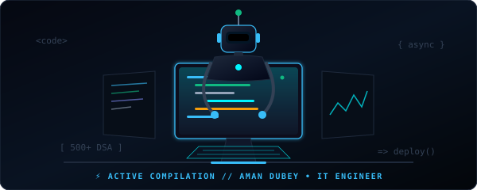

# Aman Dubey

**Software Engineer • Full-Stack Developer • Systems Builder**  
*B.Tech in Information Technology ('27) • Chandigarh Group of Colleges (CGPA: 8.17)*  
*500+ Algorithmic Problems Solved (C++) • Smart India Hackathon (SIH) Participant*

 

<!-- DYNAMIC ANIMATED ROLE TYPING -->

  

<!-- ACTION PILL BUTTONS -->

  
  &nbsp;
  
  &nbsp;
  
  &nbsp;
  
  &nbsp;
  

 

<!-- ANIMATED CODING ROBOT WORKSTATION -->

  

 

---

## 🐍 Contribution Activity

<picture>
  <source media="(prefers-color-scheme: dark)" srcset="https://raw.githubusercontent.com/amandubey923/amandubey923/output/github-snake-dark.svg" />
  <source media="(prefers-color-scheme: light)" srcset="https://raw.githubusercontent.com/amandubey923/amandubey923/output/github-snake.svg" />
  
</picture>

<i>Continuous deployment loop: The snake dynamically traverses daily Git commit contributions.</i>

 

---

## 📌 Executive Summary

* **Frontend Architecture:** Crafting responsive, zero-shift interfaces using **Next.js 14+ (App Router)**, **TypeScript**, and **Tailwind CSS** with client-side query indexing.
* **Backend & Relational Persistence:** Designing resilient RESTful endpoints in **Node.js/Express**, typed schemas with **Prisma ORM & PostgreSQL**, and **MongoDB Atlas** clusters.
* **AI & Voice Services:** Deploying conversational voice triage pipelines with **Vapi AI**, multimodal LLM reasoning via **Google Gemini API**, and real-time sync with **Convex DB**.
* **Algorithmic Mastery:** Grounded in **C++** with **500+ solved problems** (Arrays, Trees, Graphs, DP), maintaining a **250+ days consistency streak** on LeetCode & GeeksforGeeks.

---

## 🚀 Featured Production Projects

### 01 / Reader's HUB — Digital Library & Reading Ecosystem

  

> A modern digital library platform engineered for instant catalog search, book curation, and persistent reading states.

* **In-Memory Query Engine:** Client-side indexed search across titles, authors, and genres delivering sub-millisecond filtering without recurring API round-trips.
* **Persistent Session State:** Synchronized state engine retaining custom user themes, active reading progress, and bookmarks with zero layout shift on reloads.
* **Responsive Component Hierarchy:** Modular book cards, rating flows, and reader views styled with Tailwind CSS.
* **Tech Stack:** `Next.js (App Router)` · `TypeScript` · `Tailwind CSS` · `React.js` · `Node.js` · `Vercel`

&nbsp;&nbsp;&nbsp;&nbsp;

 

---

### 02 / Dentiva AI — Clinical Dental Assistant & Voice Triage

  

> An intelligent clinical assistant enabling real-time conversational voice symptom screening and doctor appointment bookings.

* **Voice-Driven Clinical Triage:** Bidirectional low-latency audio streaming via **Vapi AI SDK** to collect patient symptom narratives and assign urgency tiers.
* **Collision-Free Scheduling:** Relational PostgreSQL data model managed with **Prisma ORM** for real-time doctor slot availability and appointment locking.
* **Route-Level Security:** Enforced role-based authorization (RBAC) and session protection with **Clerk Authentication**.
* **Tech Stack:** `Next.js` · `TypeScript` · `Prisma ORM` · `PostgreSQL` · `Clerk Auth` · `Vapi Voice AI` · `Netlify`

&nbsp;&nbsp;&nbsp;&nbsp;

 

---

### 03 / Transaction Validator — High-Throughput CSV Anomaly Engine

  

> An analytical stream processing pipeline built to ingest, validate, and clean dense CSV financial transaction logs in the browser.

* **Chunked Stream Ingestion:** Ingests and parses large CSV files in chunks, ensuring the browser UI thread remains fluid and responsive.
* **Mathematical Verification:** In-memory $O(1)$ hash set deduplication and schema anomaly heuristics to detect duplicate IDs, malformed currencies, and syntax errors.
* **Client-Side Export:** In-browser dynamic blob generator to download sanitized CSVs and audit logs with zero server-side retention.
* **Tech Stack:** `Next.js` · `TypeScript` · `Tailwind CSS` · `Data Stream Algorithms` · `Vercel`

&nbsp;&nbsp;&nbsp;&nbsp;

 

---

## 🛠️ Technical Stack & Tooling

<table>
  <thead>
    <tr align="left">
      <th width="28%">Domain</th>
      <th width="72%">Technologies &amp; Official Tooling</th>
    </tr>
  </thead>
  <tbody>
    <tr>
      <td>
        &nbsp;
        <strong>Core Languages</strong>
      </td>
      <td>
         <code>C++ (Competitive &amp; STL)</code> &nbsp;&nbsp;
         <code>TypeScript</code> &nbsp;&nbsp;
         <code>JavaScript (ES6+)</code> &nbsp;&nbsp;
         <code>Python</code>
      </td>
    </tr>
    <tr>
      <td>
        &nbsp;
        <strong>Frontend &amp; UI Systems</strong>
      </td>
      <td>
         <code>Next.js 14+ (App Router)</code> &nbsp;&nbsp;
         <code>React.js</code> &nbsp;&nbsp;
         <code>Tailwind CSS</code> &nbsp;&nbsp;
        <code>HTML5 / CSS3</code>
      </td>
    </tr>
    <tr>
      <td>
        &nbsp;
        <strong>Backend &amp; Server APIs</strong>
      </td>
      <td>
         <code>Node.js</code> &nbsp;&nbsp;
         <code>Express.js</code> &nbsp;&nbsp;
        <code>RESTful APIs</code> &nbsp;&nbsp;
        <code>Next.js Server Actions</code>
      </td>
    </tr>
    <tr>
      <td>
        &nbsp;
        <strong>Databases &amp; Storage</strong>
      </td>
      <td>
         <code>PostgreSQL</code> &nbsp;&nbsp;
         <code>MongoDB Atlas</code> &nbsp;&nbsp;
         <code>Prisma ORM</code> &nbsp;&nbsp;
         <code>Convex Real-Time DB</code> &nbsp;&nbsp;
         <code>Neon Serverless SQL</code> &nbsp;&nbsp;
         <code>Firebase</code>
      </td>
    </tr>
    <tr>
      <td>
        &nbsp;
        <strong>AI &amp; Product Services</strong>
      </td>
      <td>
         <code>Google Gemini API</code> &nbsp;&nbsp;
         <code>Vapi Voice AI SDK</code> &nbsp;&nbsp;
         <code>Clerk Identity &amp; RBAC</code>
      </td>
    </tr>
    <tr>
      <td>
        &nbsp;
        <strong>DevOps &amp; Cloud Deployment</strong>
      </td>
      <td>
         <code>Git</code> &nbsp;&nbsp;
         <code>GitHub</code> &nbsp;&nbsp;
         <code>Vercel</code> &nbsp;&nbsp;
         <code>Netlify</code> &nbsp;&nbsp;
         <code>Render</code> &nbsp;&nbsp;
         <code>Railway</code> &nbsp;&nbsp;
         <code>VS Code</code> &nbsp;&nbsp;
         <code>Postman</code>
      </td>
    </tr>
    <tr>
      <td>
        &nbsp;
        <strong>Computer Science Core</strong>
      </td>
      <td>
         <code>DSA (500+ Solved in C++)</code> &nbsp;&nbsp;
         <code>Big-O Complexity Analysis</code> &nbsp;&nbsp;
         <code>OOP Principles</code> &nbsp;&nbsp;
         <code>Operating Systems</code> &nbsp;&nbsp;
         <code>DBMS Concepts</code>
      </td>
    </tr>
  </tbody>
</table>

 

---

## 🧠 Algorithmic Problem Solving & Milestones

  

<table>
  <tr>
    <td width="33%" valign="top">
      <h4>⚡ Competitive Programming</h4>
      
<b>500+ Problems Solved in C++</b> 
      Active problem solver with a <b>250+ days consistency streak</b> across competitive platforms.

      

         
        
      

    </td>
    <td width="33%" valign="top">
      <h4>🏆 Smart India Hackathon (SIH)</h4>
      
<b>National-Level Participant</b> 
      Selected participant in national hackathon rounds, designing resilient system architectures and data models under strict sprint deadlines.

      

         
        
      

    </td>
    <td width="33%" valign="top">
      <h4>🎓 Academic Excellence</h4>
      
<b>B.Tech in Information Technology</b> 
      Chandigarh Group of Colleges (CGC Mohali / Landran) 
      <b>Batch:</b> 2023 – 2027 
      <b>Cumulative GPA:</b> 8.17 / 10.0

      

        
      

    </td>
  </tr>
</table>

  
<b>🔍 Click to view Algorithmic Topic Mastery &amp; Complexity Invariants</b>

   

  | Domain / Focus | Core Patterns &amp; Algorithmic Principles Mastered |
  | :--- | :--- |
  | **Linear Structures** | Arrays, Strings, Two Pointers, Sliding Window, Monotonic Stacks, Fast &amp; Slow Pointers, Linked Lists |
  | **Hierarchical &amp; Graphs** | Binary Trees, Binary Search Trees (BST), Graph BFS/DFS Traversal, Topological Sort, Disjoint Set (DSU) |
  | **Optimization &amp; Search** | Dynamic Programming (1D/2D, Memoization, Tabulation), Binary Search on Answer, Backtracking |
  | **Systems &amp; Complexity** | Strict $O(N)$ and $O(\log N)$ Time/Space Guarantees, C++ STL Memory Pointer Operations |

 

---

## 📬 Direct Contact & Transmission

| Channel | Link | Purpose / Context |
| :--- | :--- | :--- |
| **🌐 Portfolio Website** | [aman-portfolio-next.netlify.app](https://aman-portfolio-next.netlify.app/) | Interactive portfolio & live project demos |
| **📄 Official Resume** | [Download Resume (PDF)](https://aman-portfolio-next.netlify.app/resume/Resume2.pdf) | Technical credentials & background summary |
| **💼 LinkedIn** | [linkedin.com/in/aman-kr-dubey](https://www.linkedin.com/in/aman-kr-dubey) | Professional messaging & connection |
| **⚡ GitHub** | [github.com/amandubey923](https://github.com/amandubey923) | Open-source repositories & source code |
| **🧠 LeetCode** | [leetcode.com/u/aman_dubey923](https://leetcode.com/u/aman_dubey923) | 500+ solved algorithmic problem logs |
| **🎯 GeeksforGeeks** | [geeksforgeeks.org/profile/kumaramag0dt](https://www.geeksforgeeks.org/profile/kumaramag0dt) | Competitive coding track record |
| **📧 Direct Email** | [kumaraman19137@gmail.com](mailto:kumaraman19137@gmail.com) | Opportunities & direct inquiries |

 

© 2026 Aman Dubey • Designed for performance, structural integrity, and verified engineering excellence.

