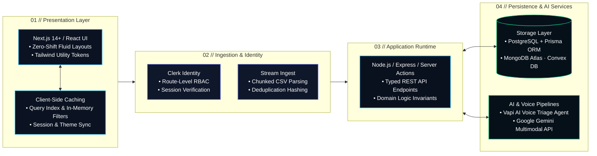

<div align="center">

<!-- HERO BANNER -->
<p align="center">
  
</p>

<!-- DYNAMIC ANIMATED TYPING SUBHEADER -->
<p align="center">
  <a href="https://github.com/amandubey923">
    
  </a>
</p>

<p align="center">
  <b>B.Tech in Information Technology ('27) • Chandigarh Group of Colleges (CGPA: 8.17)</b><br />
  <i>Architecting reactive web experiences, resilient distributed backends, and intelligent voice/AI pipelines on verified algorithmic foundations.</i>
</p>

<br />

<!-- QUICK ACTION BUTTONS -->
<p align="center">
  <a href="https://aman-portfolio-next.netlify.app/">
    
  </a>
  &nbsp;
  <a href="https://aman-portfolio-next.netlify.app/resume/Resume2.pdf">
    
  </a>
  &nbsp;
  <a href="https://www.linkedin.com/in/aman-kr-dubey">
    
  </a>
  &nbsp;
  <a href="https://leetcode.com/u/aman_dubey923">
    
  </a>
  &nbsp;
  <a href="mailto:kumaraman19137@gmail.com">
    
  </a>
</p>

<br />

<!-- HUD QUICK NAVIGATION BAR -->
<table>
  <tr>
    <td align="center"><a href="#-engineering-identity"><b>⚡ IDENTITY</b></a></td>
    <td align="center"><a href="#-flagship-production-systems"><b>🚀 FLAGSHIPS</b></a></td>
    <td align="center"><a href="#-extended-product-ecosystem"><b>📦 ECOSYSTEM</b></a></td>
    <td align="center"><a href="#-technical-stack--tooling"><b>🛠️ TECH STACK</b></a></td>
    <td align="center"><a href="#-system-architecture--lifecycle"><b>🏗️ ARCHITECTURE</b></a></td>
    <td align="center"><a href="#-algorithmic-mastery--hackathons"><b>🧠 DSA &amp; SIH</b></a></td>
    <td align="center"><a href="#-activity--telemetry"><b>📊 TELEMETRY</b></a></td>
    <td align="center"><a href="#-direct-transmission"><b>📬 CONNECT</b></a></td>
  </tr>
</table>

</div>

<br />

---

## ⚡ Engineering Identity

> "Software engineering is not just assembling frameworks—it is formulating data invariants, enforcing type safety across system boundaries, and deploying resilient products that deliver tangible user value."

<p align="center">
  
</p>

<table>
  <tr>
    <td width="50%" valign="top">
      <h3>🖥️ 01 / Interface &amp; Product Systems</h3>
      <ul>
        <li><b>Zero-Shift UI:</b> Built with Next.js 14+ (App Router), React, and Tailwind CSS for instant hydration, sub-second route transitions, and responsive fluid grids.</li>
        <li><b>Client-Side State &amp; Cache:</b> Multi-attribute query caching and resilient persistent state engines to eliminate layout thrashing.</li>
        <li><b>Accessible Interactions:</b> Strict semantic HTML, responsive viewport scaling, and keyboard-first accessibility.</li>
      </ul>
    </td>
    <td width="50%" valign="top">
      <h3>🛡️ 02 / Backend &amp; Distributed Data</h3>
      <ul>
        <li><b>Type-Safe APIs:</b> Node.js &amp; Express.js RESTful endpoints coupled with Next.js Server Actions for secure edge execution.</li>
        <li><b>Relational &amp; Document Persistence:</b> Typed schema definitions with PostgreSQL &amp; Prisma ORM alongside scalable MongoDB Atlas collections.</li>
        <li><b>Session &amp; Security:</b> Route-level role-based authorization (RBAC), token validation, and Clerk Identity protection.</li>
      </ul>
    </td>
  </tr>
  <tr>
    <td width="50%" valign="top">
      <h3>🤖 03 / Intelligent AI Workflows</h3>
      <ul>
        <li><b>Conversational Voice AI:</b> Low-latency bidirectional voice streams via Vapi AI SDK for automated clinical triage.</li>
        <li><b>Multimodal LLM Reasoning:</b> Structured prompt engineering and context processing utilizing the Google Gemini API.</li>
        <li><b>Real-Time Event Meshes:</b> Reactive subscriptions and real-time document sync powered by Convex DB.</li>
      </ul>
    </td>
    <td width="50%" valign="top">
      <h3>🧠 04 / Algorithmic Core</h3>
      <ul>
        <li><b>Asymptotic Rigor:</b> Strict $O(N)$ and $O(\log N)$ space/time discipline derived from 500+ competitive C++ algorithmic solutions.</li>
        <li><b>Data Structures:</b> Deep implementation mastery over Trees, Graphs (BFS/DFS), Dynamic Programming, and Heaps.</li>
        <li><b>System Invariants:</b> Translating complex domain logic into verifiable, clean, and bug-resistant state transitions.</li>
      </ul>
    </td>
  </tr>
</table>

<br />

---

## 🚀 Flagship Production Systems

Three verified production builds demonstrating full-stack architecture, domain-specific AI workflows, and high-throughput data processing:

<br />

### 01 / Reader's HUB — Digital Library & Reading Ecosystem

<p align="center">
  
</p>

* **Problem & Overview:** Modern web readers regularly face sluggish catalog filtering, clunky navigation, and lost reading states. Reader's HUB delivers an instant digital library platform featuring client-side indexed search, persistent reader sessions, structured reviews, and custom themes.
* **Key Architectural Innovations:**
  - **In-Memory Catalog Indexing:** Client-side query caching engine enabling sub-millisecond filtering across title, author, and genre attributes without recurring server round-trips.
  - **Persistent Session State:** Synchronized state machine retaining active bookmarks, reading progress, and dark/light modes without layout shift.
  - **Component Hierarchy:** Modular card containers, rating aggregates, and responsive layouts built with Tailwind CSS.
* **Technology Stack:** `Next.js (App Router)` · `TypeScript` · `Tailwind CSS` · `React.js` · `Node.js` · `Vercel`

<div align="center">

[](https://reader-hub-library.vercel.app/)
&nbsp;&nbsp;&nbsp;&nbsp;
[](https://github.com/amandubey923/library-optimized)

</div>

<details>
  <summary><b>🔍 Click to expand Technical Deep Dive &amp; Engineering Specifications</b></summary>
  <br />

  | Architectural Layer | Implementation Specifics |
  | :--- | :--- |
  | **Routing & Rendering** | Next.js App Router pairing static generation for base catalogs with client hydration for dynamic filtering. |
  | **Search Strategy** | Multi-attribute client-side indexing reducing API requests while maintaining sub-millisecond response times. |
  | **Theme & State Sync** | Zero-shift persistent hooks ensuring user preferences load smoothly on initial mount. |
  | **Edge Infrastructure** | Vercel Edge deployment with asset compression and continuous git-triggered releases. |
</details>

<br />

---

### 02 / Dentiva AI — Clinical Dental Assistant & Real-Time Voice Triage

<p align="center">
  
</p>

* **Problem & Overview:** Dental clinics experience recurring front-desk bottlenecks in preliminary patient triage and appointment coordination. Dentiva AI is an intelligent clinical assistant featuring real-time conversational voice symptom assessment and dynamic doctor appointment booking.
* **Key Architectural Innovations:**
  - **Bidirectional Conversational Voice Triage:** Integrated Vapi Voice AI agents to conduct real-time clinical intake interviews, route emergency urgency, and collect symptom summaries.
  - **Type-Safe Scheduling Engine:** Relational schema with Prisma ORM and PostgreSQL managing real-time doctor schedules, slot conflicts, and patient appointments.
  - **Route-Level Security:** Protected administrative rosters and patient dashboards with Clerk Identity and session validation.
* **Technology Stack:** `Next.js` · `TypeScript` · `Prisma ORM` · `PostgreSQL` · `Clerk Auth` · `Vapi Voice AI` · `Netlify`

<div align="center">

[](https://dentiva-ai-aman.netlify.app)
&nbsp;&nbsp;&nbsp;&nbsp;
[](https://github.com/amandubey923/dentiva-ai)

</div>

<details>
  <summary><b>🔍 Click to expand Technical Deep Dive &amp; Engineering Specifications</b></summary>
  <br />

  | Architectural Layer | Implementation Specifics |
  | :--- | :--- |
  | **Voice Pipeline** | Ultra-low latency bidirectional WebRTC voice streaming via Vapi Web SDK with dynamic clinical prompts. |
  | **Relational Database** | Normalized PostgreSQL schemas utilizing foreign-key constraints across Providers, Slots, and Appointments. |
  | **Authentication & RBAC** | Middleware authorization guarding clinician dashboards and patient appointment management via Clerk. |
  | **Deployment Model** | Automated continuous deployment on Netlify with isolated secret management. |
</details>

<br />

---

### 03 / Transaction Validator — High-Throughput CSV Anomaly Engine

<p align="center">
  
</p>

* **Problem & Overview:** Financial datasets regularly contain malformed entries, corrupted syntax, and duplicate transactions. Transaction Validator is an analytical stream pipeline built to parse, audit, and sanitize massive transaction CSV files directly in the browser.
* **Key Architectural Innovations:**
  - **Chunked Stream Parsing:** Batch-processing pipeline parsing large CSV files in chunks to prevent UI thread lockup.
  - **Mathematical Verification Heuristics:** In-memory record hashing algorithms to instantly detect duplicate entries, ISO currency code mismatches, and schema violations.
  - **Sanitized Export Engine:** Formatted automatic error logs and downloadable cleaned CSV files for operational use.
* **Technology Stack:** `Next.js` · `TypeScript` · `Tailwind CSS` · `Data Parsing Algorithms` · `Vercel`

<div align="center">

[](https://transaction-validator-aman.vercel.app)
&nbsp;&nbsp;&nbsp;&nbsp;
[](https://github.com/amandubey923/transaction-validator)

</div>

<details>
  <summary><b>🔍 Click to expand Technical Deep Dive &amp; Engineering Specifications</b></summary>
  <br />

  | Architectural Layer | Implementation Specifics |
  | :--- | :--- |
  | **Stream Processing** | Iterative chunked parsing eliminating out-of-memory browser crashes on multi-megabyte CSV files. |
  | **Anomaly Heuristics** | $O(1)$ hash set deduplication, checksum verification, and ISO currency regex validators. |
  | **Client-Side Export** | In-browser dynamic blob generation allowing users to download sanitized records with zero server retention. |
  | **Visual Reporting** | Real-time interactive dashboard visualizing error categories and row-by-row anomalies. |
</details>

<br />

---

## 📦 Extended Product Ecosystem

Additional verified full-stack applications, real-time collaboration platforms, and algorithmic repositories:

| Project | Architecture & Stack | Key Highlights | Direct Links |
| :--- | :--- | :--- | :--- |
| **AI Fitness** | `Next.js` · `TypeScript` · `Convex` · `Clerk` · `Google GenAI` · `Vapi` | Intelligent fitness tracking web app pairing workout logs with multimodal Gemini reasoning and voice coaching. | [🌐 Live Demo](https://ai-fitness-aman.netlify.app/) &nbsp;\|&nbsp; [📦 Code](https://github.com/amandubey923/ai-fitness) |
| **Interview VC Platform** | `Next.js` · `Stream Video SDK` · `Convex` · `Clerk` · `Monaco Editor` | Real-time technical interview suite with collaborative code editing, synchronized video calling, and live chat. | [🌐 Live Demo](https://video-calling-interview-plattform.netlify.app/) &nbsp;\|&nbsp; [📦 Code](https://github.com/amandubey923/Interview-video-calling-platform) |
| **TextWorkspace** | `React.js` · `JavaScript` · `Tailwind CSS` · `Framer Motion` | Modern web utility suite for text transformations, word metrics, case manipulation, and document generation. | [📦 Code](https://github.com/amandubey923/TextWorkspace) |
| **Reserve Food** | `Node.js` · `Express.js` · `MongoDB` · `React.js` · `MERN` | Restaurant reservation system featuring table booking schedules, menu catalog browsing, and admin controls. | [📦 Code](https://github.com/amandubey923/Reserve-Food) |
| **C++ DSA Repository** | `C++` · `STL` · `Algorithms` · `Data Structures` | Central competitive programming repository documenting optimized solutions across trees, graphs, DP, and search. | [📦 Code](https://github.com/amandubey923/DSA) |

<br />

---

## 🛠️ Technical Stack & Tooling

A comprehensive taxonomy of languages, frameworks, databases, and development tooling actively used in production:

<br />

<div align="center">

### Core Languages
[](https://isocpp.org/)
[](https://www.typescriptlang.org/)
[](https://developer.mozilla.org/en-US/docs/Web/JavaScript)
[](https://www.python.org/)

### Frontend & UI Systems
[](https://nextjs.org/)
[](https://react.dev/)
[](https://tailwindcss.com/)
[](https://developer.mozilla.org/en-US/docs/Web/HTML)
[](https://developer.mozilla.org/en-US/docs/Web/CSS)

### Backend & Server APIs
[](https://nodejs.org/)
[](https://expressjs.com/)
[](https://restfulapi.net/)
[](https://nextjs.org/docs/app/building-your-application/data-fetching/server-actions-and-mutations)

### Databases & Persistence
[](https://www.postgresql.org/)
[](https://www.mongodb.com/)
[](https://www.prisma.io/)
[](https://www.convex.dev/)
[](https://neon.tech/)

### AI & Media Services
[](https://ai.google.dev/)
[](https://vapi.ai/)
[](https://clerk.com/)
[](https://getstream.io/)

### DevOps, Cloud & Tooling
[](https://vercel.com/)
[](https://www.netlify.com/)
[](https://git-scm.com/)
[](https://github.com/)
[](https://code.visualstudio.com/)
[](https://www.postman.com/)

</div>

<br />

---

## 🏗️ System Architecture & Lifecycle

> *"Architecture is the art of connecting reactive user interfaces, resilient server execution, structured data, and intelligent AI services into a cohesive, maintainable whole."*

<p align="center">
  
</p>



### Core Architectural Principles

1. **Invariants & Asymptotics First:** Define state transitions, boundary constraints, and $O(N)$ / $O(\log N)$ algorithmic bounds before implementing application features.
2. **Strict Type Safety:** Enforce end-to-end TypeScript interfaces spanning Prisma schemas, RESTful API endpoints, and React hooks.
3. **Resilient Data Storage:** Structure normalized relational models in PostgreSQL or document schemas in MongoDB with appropriate indexing strategies.
4. **Decoupled AI Pipelines:** Encapsulate voice agents (Vapi) and generative models (Gemini) behind validated server endpoints with fallback handling.
5. **Continuous Deployment:** Leverage atomic git deployments on Vercel and Netlify with automatic asset optimization.

<br />

---

## 🧠 Algorithmic Mastery & Hackathons

<p align="center">
  
</p>

### ◈ 500+ Competitive Algorithmic Solutions (C++)
* **Core Language:** `C++` — utilizing standard template library (STL) vectors, maps, heaps, and pointers with attention to memory allocation and asymptotic space/time complexity.
* **Mastered Domains:** Arrays, Strings, Two Pointers, Sliding Window, Linked Lists, Binary Trees, Binary Search Trees, Graphs (BFS/DFS, Topological Sort), Dynamic Programming, and Recursion.
* **Competitive Profiles & Consistency:**
  - Active competitive programmer with a **250+ days consistency streak** on [LeetCode (aman_dubey923)](https://leetcode.com/u/aman_dubey923).
  - Practice, problem evaluations, and badge milestones documented on [GeeksforGeeks (kumaramag0dt)](https://www.geeksforgeeks.org/profile/kumaramag0dt).

### ◈ Smart India Hackathon (SIH) Participant
* **National-Level Collaborative Engineering:** Selected participant in national-level hackathon rounds, tackling problem statements through rapid agile sprints.
* **Technical Execution:** Designed system architectures, database schemas, and responsive frontend interfaces under rigorous evaluation deadlines.

### ◈ Academic Foundations
* **Degree:** Bachelor of Technology in Information Technology (2023 – 2027)
* **Institution:** Chandigarh Group of Colleges (CGC Mohali / Landran)
* **Academic Merit:** Cumulative Grade Point Average (CGPA): **8.17 / 10.0**
* **Core Coursework:** Data Structures & Algorithms, Database Management Systems (DBMS), Object-Oriented Programming (OOP), Operating Systems (OS), Computer Networks.

<br />

---

## 📊 Activity & Telemetry

<div align="center">

<p align="center">
  
  
</p>

[](https://github.com/amandubey923)

<br /><br />

<details>
  <summary><b>🖥️ Click to Open: System Manifest &amp; Engineering Specs</b></summary>
  <br />

```text
================================================================================
SYSTEM MANIFEST // AMAN DUBEY (amandubey923)
================================================================================
PRIMARY DISCIPLINE : Full-Stack Software Engineering & Distributed Web Systems
ACADEMIC DEGREE    : B.Tech in Information Technology (2023 – 2027) [CGPA: 8.17]
CORE LANGUAGES     : C++ (500+ DSA), TypeScript, JavaScript, Python
PRIMARY RUNTIME    : Next.js 14+ (App Router), React, Node.js, Express
DATA & STORAGE     : PostgreSQL (Prisma), MongoDB Atlas, Convex, Neon SQL
AI WORKFLOWS       : Vapi AI Conversational Voice SDK, Google Gemini API
COLLABORATION      : Smart India Hackathon (SIH) Participant
STREAK & PRACTICE  : 250+ Days LeetCode Streak, GeeksforGeeks Profile Active
AVAILABILITY       : Open for Software Engineering Internships & Full-Stack Roles
================================================================================
STATUS: TRANSMISSION VERIFIED // READY FOR DEPLOYMENT
================================================================================
```

</details>

</div>

<br />

---

## 📬 Direct Transmission

Whether you are recruiting for a Software Engineering / Full-Stack role, discussing technical architecture, or looking to collaborate on high-impact projects:

<div align="center">

| Channel | Direct Link | Purpose / Context |
| :--- | :--- | :--- |
| **🌐 Live Portfolio** | [aman-portfolio-next.netlify.app](https://aman-portfolio-next.netlify.app/) | Interactive portfolio showcasing production projects |
| **📄 Official Resume** | [Download Resume (PDF)](https://aman-portfolio-next.netlify.app/resume/Resume2.pdf) | Verified one-page technical resume & background |
| **💼 LinkedIn** | [linkedin.com/in/aman-kr-dubey](https://www.linkedin.com/in/aman-kr-dubey) | Professional networking & communication |
| **⚡ GitHub** | [github.com/amandubey923](https://github.com/amandubey923) | Source code, repositories & contribution graph |
| **🧠 LeetCode** | [leetcode.com/u/aman_dubey923](https://leetcode.com/u/aman_dubey923) | 500+ solved algorithmic problems & badges |
| **🎯 GeeksforGeeks** | [geeksforgeeks.org/profile/kumaramag0dt](https://www.geeksforgeeks.org/profile/kumaramag0dt) | Competitive coding track record |
| **📧 Direct Email** | [kumaraman19137@gmail.com](mailto:kumaraman19137@gmail.com) | Direct inquiries & recruitment opportunities |

<br />

```text
● STATUS: AVAILABLE FOR SOFTWARE ENGINEERING INTERNSHIPS & FULL-STACK ROLES
```

<br />

<sub>© 2026 Aman Dubey • Designed for performance, structural integrity, and verified engineering excellence.</sub>

</div>