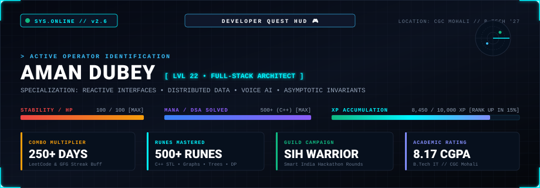

<div align="center">

<!-- CYBERPUNK GAME HUD BANNER (ANIMATED RADAR & NEON GLOW) -->
<p align="center">
  
</p>

<!-- DYNAMIC ARCADE TYPING HEADER -->
<p align="center">
  <a href="https://github.com/amandubey923">
    
  </a>
</p>

<!-- ARCADE ACTION TOKENS -->
<p align="center">
  <a href="https://aman-portfolio-next.netlify.app/">
    
  </a>
  &nbsp;
  <a href="https://aman-portfolio-next.netlify.app/resume/Resume2.pdf">
    
  </a>
  &nbsp;
  <a href="https://www.linkedin.com/in/aman-kr-dubey">
    
  </a>
  &nbsp;
  <a href="https://leetcode.com/u/aman_dubey923">
    
  </a>
  &nbsp;
  <a href="mailto:kumaraman19137@gmail.com">
    
  </a>
</p>

<br />

<!-- RETRO TERMINAL BOOT STREAM -->
<p align="center">
  
</p>

<br />

<!-- HUD QUICK NAVIGATION BAR -->
<table>
  <tr>
    <td align="center"><a href="#-player-attributes--character-sheet"><b>🎮 STATS</b></a></td>
    <td align="center"><a href="#-the-contribution-snake-game"><b>🐍 SNAKE GAME</b></a></td>
    <td align="center"><a href="#-epic-completed-quests"><b>🏆 QUESTS</b></a></td>
    <td align="center"><a href="#-developer-inventory"><b>🎒 INVENTORY</b></a></td>
    <td align="center"><a href="#-boss-fights--mastery"><b>⚔️ BOSS FIGHTS</b></a></td>
    <td align="center"><a href="#-exploration--side-quests"><b>🗺️ SIDE QUESTS</b></a></td>
    <td align="center"><a href="#-live-telemetry--stats"><b>📊 TELEMETRY</b></a></td>
    <td align="center"><a href="#-multiplayer-lobby--connect"><b>📡 CO-OP</b></a></td>
  </tr>
</table>

</div>

<br />

---

## 🎮 Player Attributes // Character Sheet

> *"In the developer realm, true power isn't measured by lines of code, but by invariant proofs, type safety, sub-millisecond execution, and unyielding problem-solving consistency."*

<table>
  <tr>
    <td width="50%" valign="top">
      <h3>⚔️ Primary Class: Full-Stack Architect</h3>
      <ul>
        <li><b>Zero-Shift UI:</b> Master of Next.js 14+ (App Router), React, and Tailwind CSS. Casts instant route transitions and fluid responsive viewports.</li>
        <li><b>State Memory:</b> Deploys multi-attribute in-memory caching and persistent local state machines with zero hydration latency.</li>
        <li><b>Accessibility Shield:</b> Strict semantic HTML and keyboard-first navigation patterns.</li>
      </ul>
    </td>
    <td width="50%" valign="top">
      <h3>🛡️ Secondary Class: Distributed Systems Warden</h3>
      <ul>
        <li><b>Resilient APIs:</b> Constructs typed RESTful endpoints in Node.js &amp; Express alongside atomic Next.js Server Actions.</li>
        <li><b>Dual Storage Mastery:</b> Normalizes relational schemas in PostgreSQL (Prisma ORM) and scales document vaults in MongoDB Atlas.</li>
        <li><b>Authentication Gatekeeper:</b> Route-level role-based authorization (RBAC) and identity protection with Clerk.</li>
      </ul>
    </td>
  </tr>
  <tr>
    <td width="50%" valign="top">
      <h3>🔮 Magic Class: AI &amp; Voice Conjurer</h3>
      <ul>
        <li><b>Conversational Voice AI:</b> Orchestrates bidirectional real-time audio triage pipelines via Vapi AI SDK.</li>
        <li><b>Multimodal Reasoning:</b> Integrates structured prompt pipelines with the Google Gemini API.</li>
        <li><b>Reactive Event Mesh:</b> Real-time subscriptions and live synchronized document state via Convex DB.</li>
      </ul>
    </td>
    <td width="50%" valign="top">
      <h3>🧠 Core Discipline: Algorithmic Berserker</h3>
      <ul>
        <li><b>Asymptotic Invariants:</b> Strict $O(N)$ and $O(\log N)$ space/time guarantees forged in 500+ competitive C++ battles.</li>
        <li><b>Pattern Mastery:</b> Flawless execution across Trees, Graphs (BFS/DFS), Dynamic Programming, and Heaps.</li>
        <li><b>Battle Streak:</b> 250+ days continuous problem-solving combo multiplier on LeetCode and GeeksforGeeks.</li>
      </ul>
    </td>
  </tr>
</table>

<br />

---

## 🐍 The Contribution Snake Game

<div align="center">

```text
╔════════════════════════════════════════════════════════════════════════════════════════════╗
║  STAGE: CONTINUOUS DEPLOYMENT  //  DIFFICULTY: NIGHTMARE  //  COINS: [ ∞ ]  //  HIGH SCORE  ║
╚════════════════════════════════════════════════════════════════════════════════════════════╝
```

<picture>
  <source media="(prefers-color-scheme: dark)" srcset="https://raw.githubusercontent.com/amandubey923/amandubey923/output/github-snake-dark.svg" />
  <source media="(prefers-color-scheme: light)" srcset="https://raw.githubusercontent.com/amandubey923/amandubey923/output/github-snake.svg" />
  
</picture>

<sub>👾 <b>RULE:</b> The Cyber-Snake consumes daily GitHub contributions. High commit velocity boosts player velocity and clears git anomalies.</sub>

</div>

<br />

---

## 🏆 Epic Completed Quests

Three verified production campaigns demonstrating end-to-end full-stack engineering, voice-driven clinical triage, and high-throughput data parsing algorithms:

<br />

### 🗡️ QUEST 01: The Citadel of Alexandria // Reader's HUB

<p align="center">
  
</p>

* **Quest Objective:** Slay catalog browsing latency, eradicate disjointed reader states, and forge an instant digital library ecosystem.
* **Battle Tactics &amp; Implementation:**
  - **In-Memory Query Engine:** Built a client-side indexing cache enabling sub-millisecond filtering across title, author, and genre without recurring server round-trips.
  - **Session State Machine:** Engineered persistent storage mechanics to retain custom themes, active reading progress, and bookmarks with zero layout flicker.
  - **Component Architecture:** Formatted modular book cards, review aggregators, and fluid reading UI using Tailwind CSS tokens.
* **Loot Dropped:** `Next.js (App Router)` · `TypeScript` · `Tailwind CSS` · `React.js` · `Node.js` · `Vercel`

<div align="center">

[](https://reader-hub-library.vercel.app/)
&nbsp;&nbsp;&nbsp;&nbsp;
[](https://github.com/amandubey923/library-optimized)

</div>

<details>
  <summary><b>📜 Click to Open: Quest 01 Combat Log &amp; Engineering Specs</b></summary>
  <br />

  | Engineering Vector | Combat Log Entry |
  | :--- | :--- |
  | **Rendering Model** | Next.js App Router pairing static catalog generation with client-side hydration for dynamic multi-filter interactions. |
  | **Search Strategy** | Multi-attribute client-side fuzzy indexing eliminating server round-trips for catalog browsing. |
  | **State Persistence** | Synchronized `localStorage` state hooks with zero layout flickers on cold reloads. |
  | **Deployment Model** | Automated edge deployment via Vercel with asset compression and continuous git delivery. |
</details>

<br />

---

### 🩺 QUEST 02: The Oracle of Aesculapius // Dentiva AI

<p align="center">
  
</p>

* **Quest Objective:** Liberate clinics from front-desk triage bottlenecks by deploying an autonomous voice companion and collision-free scheduling engine.
* **Battle Tactics &amp; Implementation:**
  - **Conversational Voice AI Agent:** Integrated Vapi AI voice pipelines allowing patients to describe dental symptoms verbally and receive instant preliminary triage classification.
  - **Collision-Free Appointment Store:** Architected a relational schema with Prisma ORM and PostgreSQL managing real-time clinician availability and slot bookings.
  - **Sanctuary Security:** Guarded administrative rosters and patient appointment history with Clerk route-level role authorization.
* **Loot Dropped:** `Next.js` · `TypeScript` · `Prisma ORM` · `PostgreSQL` · `Clerk Auth` · `Vapi Voice AI` · `Netlify`

<div align="center">

[](https://dentiva-ai-aman.netlify.app)
&nbsp;&nbsp;&nbsp;&nbsp;
[](https://github.com/amandubey923/dentiva-ai)

</div>

<details>
  <summary><b>📜 Click to Open: Quest 02 Combat Log &amp; Engineering Specs</b></summary>
  <br />

  | Engineering Vector | Combat Log Entry |
  | :--- | :--- |
  | **Voice Pipeline** | Low-latency WebRTC bidirectional audio streaming via Vapi Web SDK with dynamic symptom prompts. |
  | **Relational Database** | Normalized PostgreSQL schemas utilizing foreign-key constraints across Providers, Slots, and Appointments. |
  | **Identity &amp; RBAC** | Middleware authorization guarding clinician dashboards and patient appointment management via Clerk. |
  | **Deployment Model** | Automated continuous deployment on Netlify with isolated secret management. |
</details>

<br />

---

### ⚡ QUEST 03: The Anomaly Crucible // Transaction Validator

<p align="center">
  
</p>

* **Quest Objective:** Ingest, audit, and clean corrupted multi-megabyte CSV datasets at blistering speed without locking the browser's UI thread.
* **Battle Tactics &amp; Implementation:**
  - **Chunked Stream Ingestion:** Developed a batch-processing algorithm to parse large CSV files in chunks, keeping UI frame rates silky smooth.
  - **Mathematical Anomaly Heuristics:** Formulated record hashing algorithms to instantly isolate duplicate transaction IDs, malformed currencies, and schema anomalies.
  - **Sanitized Export Engine:** Dynamically generates cleaned CSV files and detailed audit ledgers in-browser with zero server-side retention for maximum privacy.
* **Loot Dropped:** `Next.js` · `TypeScript` · `Tailwind CSS` · `Data Parsing Algorithms` · `Vercel`

<div align="center">

[](https://transaction-validator-aman.vercel.app)
&nbsp;&nbsp;&nbsp;&nbsp;
[](https://github.com/amandubey923/transaction-validator)

</div>

<details>
  <summary><b>📜 Click to Open: Quest 03 Combat Log &amp; Engineering Specs</b></summary>
  <br />

  | Engineering Vector | Combat Log Entry |
  | :--- | :--- |
  | **Stream Processing** | Iterative chunked parsing eliminating out-of-memory browser crashes on multi-megabyte CSV files. |
  | **Anomaly Heuristics** | $O(1)$ hash set deduplication, checksum verification, and ISO currency regex validators. |
  | **Client-Side Export** | In-browser dynamic blob generation allowing users to download sanitized records with zero server retention. |
  | **Visual Reporting** | Real-time interactive dashboard visualizing error categories and row-by-row anomalies. |
</details>

<br />

---

## 🎒 Developer Inventory // Equipment Grid

A categorized inventory of weapons, armor, runes, and artifacts equipped in my daily engineering campaigns:

<div align="center">

### 🗡️ Primary Weapons Slot // Frontend &amp; Interface
[](https://nextjs.org/)
[](https://react.dev/)
[](https://www.typescriptlang.org/)
[](https://tailwindcss.com/)
[](https://developer.mozilla.org/en-US/docs/Web/JavaScript)
[](https://developer.mozilla.org/en-US/docs/Web/HTML)

### 🛡️ Defensive Armor Slot // Backend &amp; Execution
[](https://nodejs.org/)
[](https://expressjs.com/)
[](https://restfulapi.net/)
[](https://nextjs.org/)

### 💎 Soul Vaults Slot // Databases &amp; Persistence
[](https://www.postgresql.org/)
[](https://www.mongodb.com/)
[](https://www.prisma.io/)
[](https://www.convex.dev/)
[](https://neon.tech/)

### 🔮 Magic Runes Slot // AI &amp; Media Services
[](https://ai.google.dev/)
[](https://vapi.ai/)
[](https://clerk.com/)
[](https://getstream.io/)

### ⚡ Artifacts &amp; Tooling Slot // Cloud &amp; DevOps
[](https://isocpp.org/)
[](https://www.python.org/)
[](https://vercel.com/)
[](https://www.netlify.com/)
[](https://git-scm.com/)
[](https://github.com/)

</div>

<br />

---

## ⚔️ Boss Fights &amp; Mastery

<p align="center">
  
</p>

### 🐲 BOSS 01: The 500+ Algorithmic Trials (C++)
* **Combat Engine:** `C++` — utilizing Standard Template Library (STL) vectors, maps, heaps, and pointer memory models with strict asymptotic space/time complexity trade-offs.
* **Domains Conquered:** Arrays, Strings, Two Pointers, Sliding Window, Linked Lists, Binary Trees, Binary Search Trees, Graphs (BFS/DFS, Topological Sort), Dynamic Programming, and Recursion.
* **Buffs Unlocked:**
  - **250+ Days Streak Badge** on [LeetCode (aman_dubey923)](https://leetcode.com/u/aman_dubey923).
  - Practice and problem evaluation milestones on [GeeksforGeeks (kumaramag0dt)](https://www.geeksforgeeks.org/profile/kumaramag0dt).

### 🐲 BOSS 02: The National Colosseum // Smart India Hackathon (SIH)
* **National-Level Hackathon Rounds:** Selected participant in national competitive rounds, tackling real-world government/industry problem statements.
* **Combat Execution:** Designed end-to-end system architectures, relational database schemas, and intuitive frontend interfaces under strict sprint evaluation deadlines.

### 🎓 GUILD CREDENTIALS: B.Tech in Information Technology
* **Institution:** Chandigarh Group of Colleges (CGC Mohali / Landran) • **Batch:** 2023 – 2027
* **Academic Merit:** Cumulative GPA: **8.17 / 10.0**
* **Core Coursework:** Data Structures &amp; Algorithms, Database Management Systems (DBMS), Object-Oriented Programming (OOP), Operating Systems (OS), Computer Networks.

<br />

---

## 🗺️ Exploration &amp; Side Quests

Additional public repositories and software adventures available in the open world:

| Expedition | Architecture &amp; Stack | Quest Description | Direct Links |
| :--- | :--- | :--- | :--- |
| **🏋️ AI Fitness** | `Next.js` · `Convex` · `Clerk` · `Gemini AI` · `Vapi` | Full-stack AI fitness web application pairing workout logging with multimodal Gemini reasoning and voice coaching. | [🌐 Live Demo](https://ai-fitness-aman.netlify.app/) &nbsp;\|&nbsp; [📦 Code](https://github.com/amandubey923/ai-fitness) |
| **🎙️ Interview VC Platform** | `Next.js` · `Stream Video` · `Convex` · `Clerk` · `Monaco` | Real-time technical interview workspace with synchronized video calling, collaborative code editor, and live chat. | [🌐 Live Demo](https://video-calling-interview-plattform.netlify.app/) &nbsp;\|&nbsp; [📦 Code](https://github.com/amandubey923/Interview-video-calling-platform) |
| **📝 TextWorkspace** | `React.js` · `JavaScript` · `Tailwind CSS` · `Framer Motion` | Modern web utility suite for text transformations, word metrics, case manipulation, and document generation. | [📦 Code](https://github.com/amandubey923/TextWorkspace) |
| **🥘 Reserve Food** | `Node.js` · `Express.js` · `MongoDB` · `React.js` · `MERN` | Restaurant reservation system featuring table booking schedules, menu catalog browsing, and admin controls. | [📦 Code](https://github.com/amandubey923/Reserve-Food) |
| **⚔️ C++ DSA Repository** | `C++` · `STL` · `Algorithms` · `Data Structures` | Central competitive programming repository documenting optimized solutions across trees, graphs, DP, and search. | [📦 Code](https://github.com/amandubey923/DSA) |

<br />

---

## 📊 Live Telemetry &amp; Stats

<div align="center">

<p align="center">
  
  
</p>

[](https://github.com/amandubey923)

<br /><br />

<details>
  <summary><b>🖥️ Click to Open: Player Character Sheet &amp; Technical Specs</b></summary>
  <br />

```text
================================================================================
PLAYER DOSSIER // AMAN DUBEY (amandubey923)
================================================================================
CLASS TITLE        : Full-Stack Systems Architect & Algorithmic Problem Solver
CURRENT LEVEL      : 22 [EXPEDITION YEAR: 2026]
ACADEMIC STATUS    : B.Tech in Information Technology (2023 – 2027) [CGPA: 8.17]
PRIMARY ENGINES    : Next.js 14+ (App Router), React, Node.js, Express
LANGUAGES MASTERED : C++ (500+ Solved), TypeScript, JavaScript, Python
DATA STORAGE       : PostgreSQL (Prisma), MongoDB Atlas, Convex, Neon SQL
AI INTEGRATIONS    : Vapi AI Conversational Voice SDK, Google Gemini API
HACKATHON BADGES   : Smart India Hackathon (SIH) Participant
STREAK MULTIPLIER  : 250+ Days Streak (LeetCode & GeeksforGeeks)
CO-OP AVAILABILITY : Open for Software Engineering Internships & Full-Stack Roles
================================================================================
TRANSMISSION ACTIVE // READY TO DEPLOY
================================================================================
```

</details>

</div>

<br />

---

## 📡 Multiplayer Lobby // Connect

Looking to assemble a party for a Software Engineering / Full-Stack role, collaborate on high-impact systems, or discuss architecture:

<div align="center">

| Channel | Direct Link | Purpose / Context |
| :--- | :--- | :--- |
| **🌐 Interactive Portfolio** | [aman-portfolio-next.netlify.app](https://aman-portfolio-next.netlify.app/) | Live production applications & showcase |
| **📄 Official Resume** | [Download Resume (PDF)](https://aman-portfolio-next.netlify.app/resume/Resume2.pdf) | One-page verified technical resume & background |
| **💼 Guild LinkedIn** | [linkedin.com/in/aman-kr-dubey](https://www.linkedin.com/in/aman-kr-dubey) | Professional networking & message transmission |
| **⚡ GitHub Hub** | [github.com/amandubey923](https://github.com/amandubey923) | Source code, repositories & contribution graph |
| **🧠 LeetCode Arena** | [leetcode.com/u/aman_dubey923](https://leetcode.com/u/aman_dubey923) | 500+ solved algorithmic problems & badges |
| **🎯 GeeksforGeeks** | [geeksforgeeks.org/profile/kumaramag0dt](https://www.geeksforgeeks.org/profile/kumaramag0dt) | Competitive coding track record & streak |
| **📧 Direct Transmission** | [kumaraman19137@gmail.com](mailto:kumaraman19137@gmail.com) | Direct inquiries & recruitment opportunities |

<br />

```text
● STATUS: READY FOR MULTIPLAYER // AVAILABLE FOR SWE INTERNSHIPS & FULL-STACK ROLES
```

<br />

```text
╔════════════════════════════════════════════════════════════════════════════════════════════╗
║  GAME OVER? NO.  INSERT COIN TO INITIATE HIGH-IMPACT COLLABORATION // AMAN DUBEY © 2026   ║
╚════════════════════════════════════════════════════════════════════════════════════════════╝
```

</div>